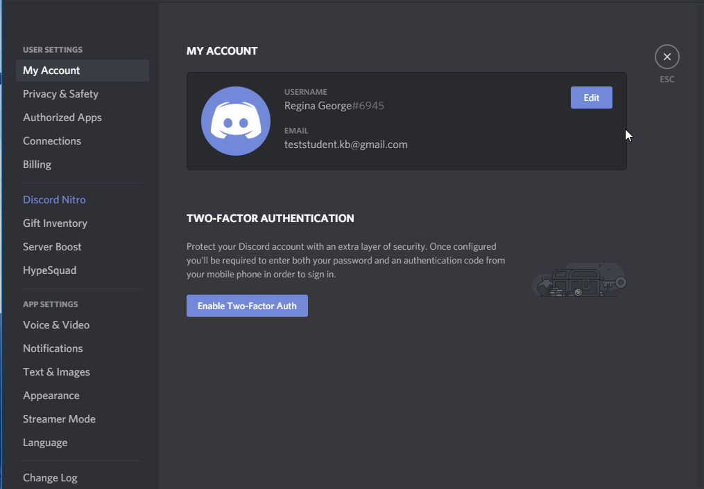
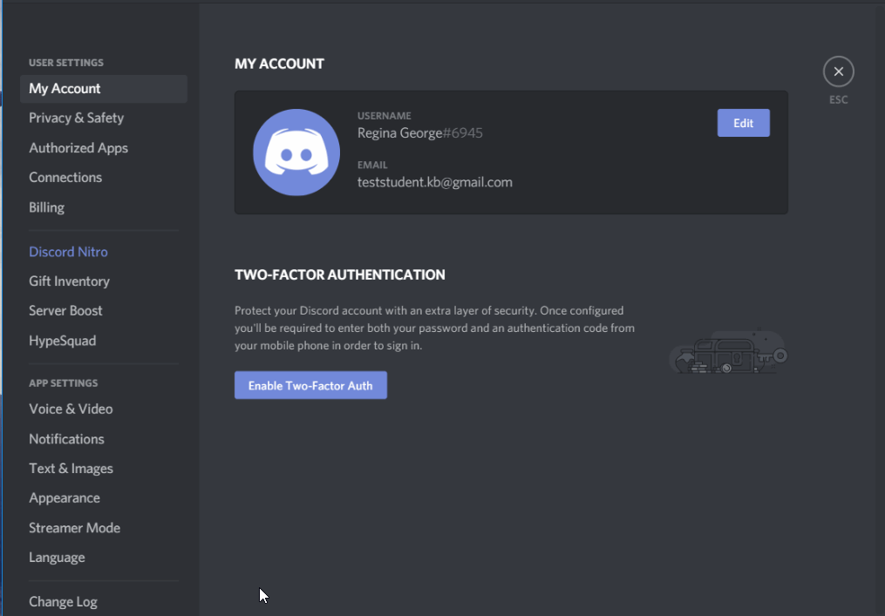
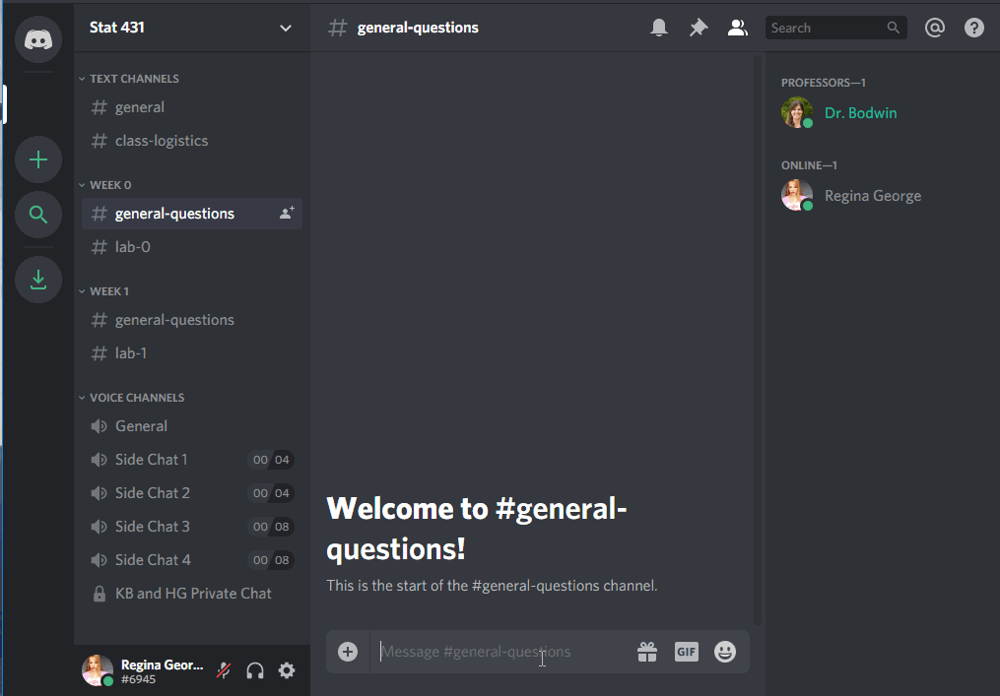
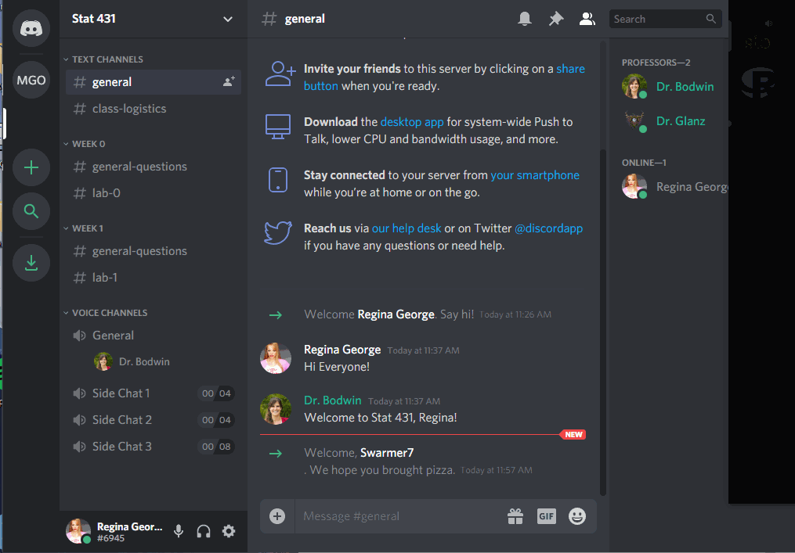
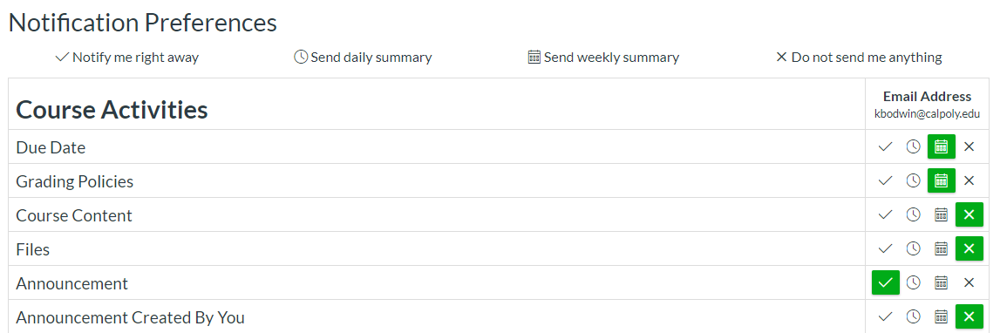

```{r setup, include=FALSE}
knitr::opts_chunk$set(echo = TRUE)
```

```{r, include = FALSE}
library(tidyverse)
library(emo)
```


Welcome!

In this coursework, you'll get set up with the Class Discord, learn about what
is expected of you each week, and hear some tips from me about how to succeed.


## Coursework TODOs

`r emo::ji("book")` Readings: 15 minutes 

`r emo::ji("computer")` Activities: 0 min 

`r emo::ji("check")` Check-ins: 3

---

# Synchronous Meetings

---

This is an in-person course, scheduled to meet on Mondays, Tuesdays, 
Wednesdays and Thursdays for 1 hour at a time. We **will** be meeting every day
this quarter, and attendance is expected. 

We will be using Discord for our out of class discussions. 

---

# Using the Class Discord

---

We'll be using Discord to interact with our peers and group members. 

Discord is a platform for text chatting, voice chatting, and screen sharing.

In particular, virtual office hours will be held on Discord. Through Discord, 
you can ask me public questions, we can meet one-on-one or in small group. 

The office hours for this class are:

#### Tuesdays & Thursdays from 1-1:30pm
#### Wednesdays from 7-8pm

I will often be willing to hop on Discord and help out at other times, and
I will answer text chat questions regularly every weekday and occasionally on 
weekends!

---

## Join the server


Join the [Stat 313 Server (https://discord.gg/TupTVEcb)](https://discord.gg/TupTVEcb) to start experimenting 
with the interface.

When you join the server, you will be given some suggestions to get started.  


We recommend you click through these - and in particular, it is probably a good
idea to download the desktop version of Discord, and perhaps to install it on
your phone if you wish.

---

## Set up your account

### Verify your email

To use this Discord server, you **must** have a verified email.  

Nobody (including your professors) will be able to see this email, and it does 
not have to be your Cal Poly email.  This is simply to keep the server from 
being overrun by temporary accounts.


### Create your identity

The first thing you should do is decide what name and picture you would like to
use.




We would like to **strongly** encourage you to use your 
**real name and picture**, so that we can get to know you.  However, if you
prefer to remain anonymous, you are free to do so.


(Please do not be like Regina and use the name of another student, however!  
This kind of impersonation will result in a permanent ban from the server.)


### Decide about privacy and notifications

The default settings on the channel are probably just fine for you.  
Feel free to make any changes that work for you, though.

You can change your message notifications:




You can edit your privacy settings, although most things are already private:


### Connect other apps

You can connect other apps to Discord, either for productivity or just for fun.


---

## Using the Channels

The server is made up of many channels.  Some are text chatrooms, while some are
"Voice Channels" that connect you via audio to everyone else in the channel.


### Text Channels

Use the `#general` channel for anything and everything:


If your question is about course logistics, rather than the material itself,
consider using the `#class-logistics` channel:


You can use the specific weekly channels to ask questions about the material...



... or the specific lab assignment.


Notice that you can use tick marks (` ``` `), like you will learn in R Markdown,
to make your code appear in a formatted code box.


### Voice Channels

To join a voice channel, simply click it!  Make sure you are careful about when
you are muted or unmuted.


The extra "Side Chat" channels are limited to 4 or 8 people, if you would like 
to start an impromptu study conversation without being heard by the professors 
and/or the rest of the class.  (We'll only drop in if you invite us!)

Voice channels can also be used for people to "Go Live", and share their screen 
with everyone else.



While this will usually be something professors use to demonstrate code, you can
go live, too!  But you may need to download the desktop version of Discord to do
so.


### Private messages

It is also easy to send private messages, to your professor(s) or to each other.
These private messages can also easily be used to launch a private video chat
and/or screen sharing.


---

## Creating your own server

Last but not least - for the teams you are a part of, you may want to use
Discord to communicate with each other about the weekly assignments. You can do
this by creating your own server! You can easily hop between servers during work
parties, to ask each other questions or just to take a break and chat about 
life.


---

## See you at the Party!

---

`r emo::ji("check")` Check-in 1: Introductions (on Discord) 

Introduce yourself in the "Introductions" channel of the Discord Server. 
Be sure to include:

- the name you prefer for everyone to use
- your major
- something you like to do outside of school

---

# Course Structure

---

[Required Video: Class Structure]()

---

## What your typical week will look like

### Coursework

Each week, you will be expected to work through a sequence of readings, videos,
and check-ins. (Much like this one!)

These are meant to replace the in-class lecture experience, so we are able to 
engage in productive discussions and hands-on activities in class. You should
plan to devote about 1-3 hours a week to completing the coursework. 


### Group Discussions / Conceptual Homework

**Due Wednesdays at 8pm**

As part of your "in-class" work, your group will put together your thoughts on 
a variety of questions regarding the week's content. This is intended to be an 
opportunity for you to talk with others about your ideas, put them on paper, 
and get feedback from me. You will work on these questions in class everyday, 
but you may need additional time to complete the written report by Wednesday. 

Homework is completed in **teams**. Please read the description of the team
roles that will be circulated around. 

Homework will be submitted on Canvas. 

**Note:** Homework is due by the end of my office hours on Wednesdays. This 
allows for you to pop in to my office hours and ask any final questions you 
have or let me know if you need a deadline extension. 


### Weekly Quizzes

**Due Sundays at 8pm**

Each week there will be a short (~10 questions) quiz over the reading and 
videos from the week. These quizzes are intended to ensure that you grasped the 
key concepts from the week's readings. The quizzes are not timed, so you can 
feel free to check your answers with the textbook and/or videos if you so wish. 

### Think Out Loud Recordings 

**Due Sundays at 8pm**

Every week I will post one "big picture" conceptual question from the content 
covered the prior week, which you are required to record your response to the 
prompt. You should think of this "think out loud" as the second check point for 
the content covered each week. 

Each recording will be done through FlipGrid, associated with a Canvas
assignment.

Because these assignments are intended to give you practice explaining your 
conceptual understanding of each week's content, full credit will be given so
long as you provide a response that demonstrates you have spent time thinking
about the concepts. 


### Tutorials

**Must be completed before each lab assignment**

On the lab assignment weeks (every other week starting in Week 2), I will assign
a set of tutorials focusing on specific skills in `R`. These tutorials provide a
review of the concepts covered in the textbook, give examples of how to work
with data in `R`, and have hand-on exercises where you will need to write the
`R` code necessary to complete a given task (with hints provided). 

The tutorials are work at your own pace, so you can complete them all at once or
slowly throughout the week. The lab assignments will require for you to put the
skills you learned in the tutorials to work, so completing the tutorial is 
necessary to complete the `R` code in each lab assignment.  


### Lab Assignments

**Due every other Sunday at midnight**

Aside from the Final Project and Exams, the majority of your grade in this class
comes from Lab Assignments.  You should plan to spend a large amount of time 
outside of class (5-10 hours every other week) completing your Lab Assignment.

Lab work is also completed in **teams**. 

Labs will be administered through RStudio Cloud and submitted on Canvas.

---

`r emo::ji("check")` Check-in 2: Course Set-up Quiz (on Canvas)

**Question 1:** Where can you visit me for office hours? 

**Question 2:** What materials and technology are required for this course? 

**Question 3:** In this course, what is due every Wednesday? 

**Question 4:** What day are Think Out Loud Recordings, Weekly Quizzes, and 
Lab Assignments due?

**Question 5:** Revisions will be required for questions not earning at least
what score on lab assignments?

**Question 6:** How will the midterm and final exams be administered?

**Question 7:** You have finished the week's lab assignment, and you want to
know if you did it right.  You ask your friend, and she says, "Oh, for that
question I got *Luke Skywalker* as my answer."  This is a violation of the
Academic Honesty policy.  

**Question 8:** You and a friend have been working on the lab assignment
together.  You finish up and want to go to bed, but they are still a little 
confused.  You email them your file, and say, "Don't copy this, just look how I
did it so you can figure it out." You have violated the Academic Honesty policy. 

**Question 9:** You have been working on making a visualization for the lab 
assignment for what feels like forever and it seems like you are making little to
no progress. You type the prompt into Google and "Wham!" the first result is a
Stack Overflow page with a solution. You copy-and-paste the solution from the 
Stack Overflow page into your lab assignment and do not reference that you used 
an outside source. You have violated the Academic Honesty policy.  

**Question 10:** Name one of the course learning objectives that makes you 
excited. 

**Question 11:** Name one of the course learning objectives that makes you 
nervous. 

---

`r emo::ji("check")` Check-in 3: Team Formation Schedule Survey 

[Link to Google Form (https://forms.gle/ZdqafyMhYi7mfJTz8)](https://forms.gle/ZdqafyMhYi7mfJTz8)

---

# What to do when you have questions

---

Stuck on something, or have a logistical question about the course?  
Follow these easy steps to success!

## Make sure your question isn't already answered somewhere.

#### Double-check the syllabus.


#### Double-check the instructions for the assignment.

Remember that most details will appear in the Coursework pages or in the Lab
Assignment instructions - not in the submission links on Canvas.

#### Double-check the Announcements

On the "Account" section of Canvas, under "Notifications", make sure your 
preferences are updated for Announcements.  We recommend opting to receive an 
email any time an announcement is posted.



---


## Ask your question on Discord

If you post your question to a text channel, you will probably get a fast
response from a classmate.  If not, you will get a response from me within 
24 hours.

---


## Send a message via Canvas

If your question is private, you may message me directly via Canvas.

To do so, find the "Inbox" section, and click "compose a new message".

**Note:** Although I *will* answer emails, I strongly prefer Canvas messages.


---


# Tips for succeeding in this class:

---

## Take the Coursework page as seriously as you take in-person lecture.

The coursework is intended to give you time to process the week's content on 
your own schedule. I don't believe students get much out of listening to a 
professor ramble for 50 minutes, and would much rather have group conversations. 
But, for these conversations to work, I need for everyone to show up to class 
prepared! 

## Treat your teammates with respect and compassion 

I completely understand that some of us may have apprehensions for a class that 
uses a lot of group work. As you will learn, I am a person that is *extremely* 
detail oriented, which makes it **really** difficult to work with others. Over
the years I've learned that I actually learn a lot more if I let people in, and 
bend my need to control every situation. So if you are someone like me, I 
strongly encourage you to try letting people into your space and see all that 
you can learn from them! 

Alternatively, you might be someone who has been burned by someone when working 
in a group. Maybe someone took control of the project you were working on,
didn't listen to your ideas, or made you feel very unwelcome. I hear you! I've 
been there and it hurts. Know that I will be doing everything in my power to 
make sure every team is functioning as a group, with no one taking charge and 
no one getting steamrolled. We are a community of learners and need to give 
*everyone* the opportunity to be heard. 

