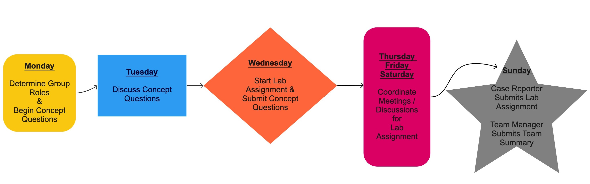

.larger[About Me...]

```{r, echo = FALSE, out.width = "45%", out.height = "20%", fig.show = 'hold', fig.align='default'}
knitr::include_graphics(c("images/bikes.jpg", "images/wedding.png"))
```


---

class: center, inverse

.gray[.huge[Group Norms]]

--

</br> 

.honey[.bitlarger[I expect that as a class we *all* abide by a set of group norms.]]

---

class: middle 

- .honey[Zero tolerance for any "ism": racism, sexism, homophobia, transphobia, ageism, ableism, xenophobia, religious prejudice]  

--

- .rhubarb[Speak for yourself and your own experience -- use “I” statements
  * When we generalize from our experience we risk shutting other people down.]

--

- .dark-blue[Respect one another]

--

-	.gray[Listen respectfully when others are speaking, even if you don’t agree.]

--

-	.pink[One speaker at a time.] 

--

-	.bayberry[Be gentle with each other when disagreeing.]

---

- .dark-blue[Non-judgmental 
  * There are no "dumb" questions]
  
--

- .mango[Take space, make space -- Share the air  
  * Challenge yourself to take space if you tend to be quieter,
  make space if you find yourself talking a lot or otherwise taking up space.  
  * Be aware of your airtime to ensure all voices are heard.]

--

- .bayberry[Embrace discomfort]

--

- .gray[Make decisions by consensus]

---

class: inverse, center

.larger[What is Statistics?]

--

> Scientists seek to answer questions using rigorous methods and careful
> observations. These observations – collected from the likes of field notes,
> surveys, and experiments – form the backbone of a statistical investigation
> and are called data.  

> Statistics is the study of how best to collect, analyze,
> and draw conclusions from data. 
>
> _Introduction to Modern Statistics_

---

class: center, inverse

.larger[What Statistics Is To Me]

</br>
</br>

<center>


---

class: middle 

.larger[What you can expect]

6 units separated by statistical concepts / methods 

--

- Unit 1: Foundations of Statistics 

- Unit 2: Exploratory Data Analysis

- Unit 3: Regression Modeling 

- Unit 4: Foundations of Statistical Inference  

- Unit 5: Inference for Regression 

- Unit 6: A Special Case of Regression (ANOVA)

---

class: inverse, center

.huge[
.hand[Course Structure] 
]

---

class: inverse, center

.larger[Individual Expectations]


---

class: inverse, center

.larger[Team Expectations]



---

.larger[**"Doing" Statistics**] 

</br> 

- Coding is a **huge** part of what doing statistics looks like

--

- Everyone is coming from a different background 

--

- Different aspects of the course will be difficult to different people 

--

- Use your peers to support your learning 

---

.larger[**Working in Teams**]

</br> 

- I believe learning is social

--

- Explaining our thinking to others solidifies our understanding

--

- We can grow from the perspectives of others 

--

- We can support each other 

---

class: center

.larger[**Oral Exams**]

</br> 

--

**Emphasis on articulating your understanding**

--

</br> 

**Flexibility to use examples familiar to you**
