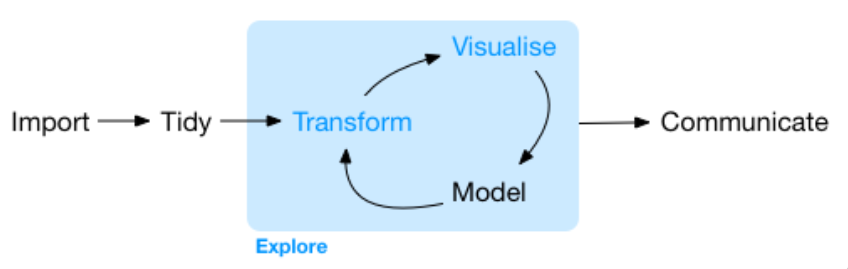

class: middle, center

.larger[About Me...]

```{r, echo = FALSE, out.width = c("35%", "25%", "25%"), out.height = "20%", fig.show = 'hold', fig.align='default'}
knitr::include_graphics(c("images/wedding.png", "images/skiing.JPG", "images/bumi.JPG"))
```

Ph.D. in Statistics from Montana State University

B.S. in Mathematics from Colorado Mesa University

---

class: center, inverse

.gray[.huge[Group Norms]]

--

</br> 

.honey[.bitlarger[I expect that as a class we *all* abide by a set of group norms.]]

---

class: middle 

- .honey[Zero tolerance for any "ism": racism, sexism, homophobia, transphobia, ageism, ableism, xenophobia, religious prejudice]  

--

- .rhubarb[Speak for yourself and your own experience -- use “I” statements
  * When we generalize from our experience we risk shutting other people down.]

--

- .dark-blue[Respect one another]

--

-	.gray[Listen respectfully when others are speaking, even if you don’t agree.]

--

-	.pink[One speaker at a time.] 

--

-	.bayberry[Be gentle with each other when disagreeing.]

---

- .dark-blue[Non-judgmental 
  * There are no "dumb" questions]
  
--

- .mango[Take space, make space -- Share the air  
  * Challenge yourself to take space if you tend to be quieter,
  make space if you find yourself talking a lot or otherwise taking up space.  
  * Be aware of your airtime to ensure all voices are heard.]

--

- .bayberry[Embrace discomfort]

--

- .gray[Make decisions by consensus]

---

class: inverse, center

.larger[What is Statistics?]

--

> Scientists seek to answer questions using rigorous methods and careful
> observations. These observations – collected from the likes of field notes,
> surveys, and experiments – form the backbone of a statistical investigation
> and are called data.  

> Statistics is the study of how best to collect, analyze,
> and draw conclusions from data. 
>
> _Introduction to Modern Statistics_

---

class: center, inverse

.larger[What Statistics Is To Me]

</br>
</br>

<center>



---

class: middle 

.larger[What you can expect]

6 units separated by statistical concepts / methods 

--

- Unit 1: Foundations of Statistics 

- Unit 2: Exploratory Data Analysis

- Unit 3: Regression Modeling 

- Unit 4: Foundations of Statistical Inference  

- Unit 5: Inference for Regression 

- Unit 6: A Special Case of Regression (ANOVA)

---

class: inverse, center

.huge[
.hand[Course Structure] 
]

---

class: inverse, center

.larger[Individual Expectations]


---

class: inverse, center

.larger[Team Expectations]


---

.larger[**"Doing" Statistics**] 

</br> 

- Coding is a **huge** part of what doing statistics looks like

--

- Everyone is coming from a different background 

--

- Different aspects of the course will be difficult to different people 

--

- Use your peers to support your learning 

---

.larger[**Working in Teams**]

</br> 

- I believe learning is social

--

- Explaining our thinking to others solidifies our understanding

--

- We can grow from the perspectives of others 

--

- We can support each other 

---

class: center

.larger[**Oral Exams**]

</br> 

--

**Emphasis on articulating your understanding**

--

</br> 

**Flexibility to use examples familiar to you**

---

.huge-text[Break]

---

class: middle 

.larger[.hand[Warm-up Exercises (in pairs)]]

- What is **S**tatistics?

- What are two similarities and two differences between Statistics and 
Mathematics? 

---

class: center, inverse

.huge[Tidy Data]


---

class: center

.larger[There's Data]

<center>
Gender stereotypes in 5-7 year old children
</center>

</br>
        
```{r, echo = FALSE}
children_gender_stereo[[2]] %>% 
  rename(sex = gender) %>% 
  sample_n(6) %>%
  kable(format = "html") %>% 
  kable_styling(bootstrap_options = c("striped", "condensed"), 
                latex_options = "striped")
  
```

---

class: center

.larger[Lots and Lots of Data]

Body girth measurements and skeletal diameter measurements for 247 men and 
260 women.

```{r, echo = FALSE}
bdims %>% 
  sample_n(6) %>% 
  select(age, wgt, hgt, sex, sho_gi, wai_gi, nav_gi, hip_gi) %>% 
  kable() %>% 
  kable_styling(bootstrap_options = c("striped", "condensed"), 
                latex_options = "striped")
```

---

class: center

.larger[In Every Context]

<center> 
NBA player of the week from 1985 to 2016
</center>

</br>

```{r, echo = FALSE}
nba %>% 
  sample_n(6) %>%
  select(Age:Position) %>% 
  kable(format = "html") %>% 
    kable_styling(bootstrap_options = c("striped", "condensed"), 
                latex_options = "striped")
```

---

class: center

.larger[You Could Imagine]

<center>
Fish Sampled on Blackfoot River
</center>

</br>

```{r, echo = FALSE}
fish %>% 
  sample_n(6) %>%
  kable(format = "html") %>% 
    kable_styling(bootstrap_options = c("striped", "condensed"), 
                latex_options = "striped")
```

---

class: center

.huge[.hand[Your Turn]]

.larger[How could a dataset violate the "tidy" principles?]

---

class: center, inverse

.larger[Types of Variables]

</br>


---

class: middle 

.huge[Examples]

- A person's height (usually) would be a **continuous, numerical** variable 

- The number of classes someone takes would be a **discrete, numerical**
variable

- A course letter grade would be a **ordinal, categorical** variable 

- The color of someone's hair would be a **regular, categorical** variable

---

class: center

.huge[.hand[Your Turn]]

.rhubarb[.bitlarger[Suppose researchers have data from 2010 - 2020.]]

.gray[.bitlarger[What type of variable would year be?]]

---

<!-- class: center  -->

<!-- .larger[#90 Second Writing Exercise] -->

<!-- Data were collected on thousands of loans made through the Lending Club platform, a platform that allows individuals to lend to other individuals.  -->

<!-- A total of 55 variables were collected on every loan that was made, including information about:  -->

<!-- - the borrower's employment, credit, current financial status, tax filings -->
<!-- - the loan's details, date of issue, balance, and current status -->

<!-- </br> -->

<!-- .large[__What do you expect this dataframe would look like?__] -->

---

.larger[Data Types in `R`]

```{r, echo = FALSE}
loans_full_schema <- loans_full_schema %>% 
  select(emp_title,
         emp_length, 
         state, 
         annual_income, 
         verification_income_joint, 
         delinq_2y,
         earliest_credit_line) 
```

```{r echo = TRUE}
glimpse(loans_full_schema)
```

.pull-left[
What do you think `dbl` means?  

How is that different from `int`?
]

.pull.right[

What does `chr` mean?

How might it differ from `fct`?
]
---

class: center, inverse 

.larger[Sampling Strategies]

```{r pop-to-sample, fig.align = 'center', echo = FALSE}
par_og <- par(no.readonly = TRUE) # save original par
par(mar = rep(0, 4))
plot(c(0, 2),
     c(0, 1.1),
     type = 'n',
     axes = FALSE, 
     xlab = "",
     ylab = "")
temp <- seq(0, 2 * pi, 2 * pi / 100)
x <- 0.5 + 0.5 * cos(temp)
y <- 0.5 + 0.5 * sin(temp)
lines(x, y)

s <- matrix(runif(700), ncol = 2)
S <- matrix(NA, 350, 2)
j <- 0
for (i in 1:nrow(s)) {
  if(sum((s[i, ] - 0.5)^2) < 0.23){
    j <- j + 1
    S[j, ] <- s[i, ]
  }
}
points(S, col = COL[1, 3], pch = 20)
text(0.5, 1, 'population', pos = 3, cex = 1.3)

set.seed(50)
N <- sample(j, 25)
lines((x - 0.5) / 2 + 1.5, (y - 0.5) / 2 +  0.5, pch = 20)

SS <- (S[N, ] - 0.5) / 2 + 0.5
these <- c(2, 5, 11, 10, 12)
points(SS[these, 1] + 1,
       SS[these, 2],
       col = COL[4, 2],
       pch = 20,
       cex = 1.5)
text(1.5, 0.75, 'sample', pos = 3, cex = 1.3)

for (i in these) {
  arrows(S[N[i], 1], S[N[i], 2],
         SS[i, 1] + 1 - 0.03, SS[i, 2],
         length = 0.08, col = COL[5], lwd = 1.5)
}
par(par_og) # restore original par
```

---

class: center

.huge[.hand[Your Turn]]

.rhubarb[.bitlarger[What types of samples could we collect? Are some methods 
"better" than other methods?]]

---

class: inverse 

.huge[Types of Studies]

.pull-left[
.honey[.larger[Experiment]]

- randomization 
- replication 
- controlling
- blocking

]

.pull-right[
.mango[.larger[Observational Study]]

- collect data in a way that does not directly interfere with how the data arise
]

---

.center[
.bayberry[.larger[Relationships Between Variables]]

</br>

explanatory variable $\rightarrow$ *might affect* $\rightarrow$ response variable
]

</br>

- If two variables are not associated, then they are said to be __independent__. 

- If two variables are associated, then they are said to be __dependent__. 

---

class: center, inverse 

.huge[Causal Inference]

</br> 

association $\neq$ causation 

</br>

.large[What do you need to say that the explanatory variable .mango[causes] a
change in the response variable?]

---

class: middle 

.gray[.huge[Philosophy of Statistics]]

What is dichotomous thinking?  

What is an example of dichotomous choices?   

--

.rhubarb[How is dichotomous thinking used in Statistics?]

---

.huge[.hand[Your Turn]]

- What is the role of Statistics in the progression of science?

- How is dichotomous thinking used in Statistics? What are two 
benefits and drawbacks of dichotomous thinking?

---

.larger["objective" and "significant"]

</br>

- What does it mean for an analysis to be "objective"? Do you believe 
statistical analyses can be objective? Why or why not?

</br>

- What are 4-5 synonyms of "significant" that come to your mind?

</br>

- What are two issues that you see with using the term "significant" 
to denote "small" p-values? 

