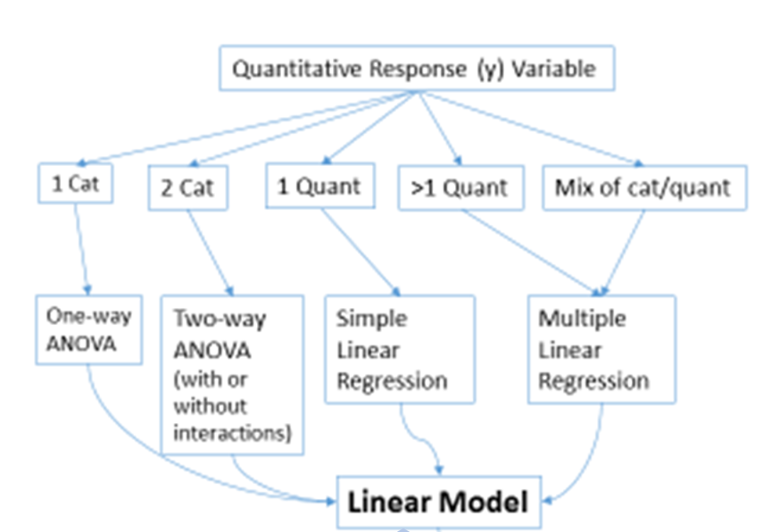

<style type="text/css">
slides > slide:not(.nobackground):after {
  content: '';
}
</style>

```{r setup, include=FALSE}
set.seed(12345)
knitr::opts_chunk$set(warning = FALSE, 
                       message = FALSE, 
                      fig.width = 5, 
                      fig.height = 4, 
                      results = "hold")

options(show.signif.stars = FALSE)

library(knitr)
library(tidyverse)
library(moderndive)
library(openintro)
library(infer)
library(flair)
library(broom)
library(gridExtra)
library(RColorBrewer)

movies <- movies_sample %>% 
  mutate(era = case_when(year < 1920 ~ "1910s", 
                         year >= 1920 & year < 1930 ~ "1920s", 
                         year >= 1930 & year < 1940 ~ "1930s", 
                         year >= 1940 & year < 1950 ~ "1940s", 
                         year >= 1950 & year < 1960 ~ "1950s", 
                         year >= 1960 & year < 1970 ~ "1960s", 
                         year >= 1970 & year < 1980 ~ "1970s", 
                         year >= 1980 & year < 1990 ~ "1980s", 
                         year >= 1990 & year < 2000 ~ "1990s", 
                         year >= 2000 ~ "2000s")) %>% 
  filter(era %in% c("1970s", "1980s", "1990s", "2000s"))
```

## ANOVA 

</br> 

- One-way ANOVA: one categorical explanatory variable 

- Two-way ANVOA: two categorical explanatory variables 

  * Goal: describe the means of different groups, and identify whether they are
similar or different 


## One-way ANOVA 

```{r, echo = FALSE, fig.width=8}
eras <-  movies %>% 
  ggplot(aes(x = era, y = rating, fill = era)) + 
  geom_violin() + 
  scale_fill_brewer(palette = "Paired") + 
  labs(x = "Year of Movie Release", 
       y = "IMDB Moving Rating") + 
  theme(legend.position = "none")

genres <- movies %>% 
  ggplot(aes(x = genre, y = rating, fill = genre)) + 
  geom_violin() + 
  scale_fill_brewer(palette = "Dark2") + 
  labs(x = "Year of Movie Release", 
       y = "") + 
  theme(legend.position = "none")

grid.arrange(eras, genres, nrow = 1)

```

## Model Hypotheses 

$H_0$: all of the group means are the same in the population 

* $\mu_{1970} = \mu_{1980} = \mu_{1990} = \mu_{2000}$

* There is no difference in the mean rating between different years, for all 
movies made between 1970 and 2009

</br> 

$H_A$: at least one of the means differs in the population 

* At least one $\mu_i$ differs  

* The mean movie rating for at least on era is different, for all movies made
between 1970 and 2009. 

## To Permute or F it? 

To conduct a hypothesis test, you have two choices:  

1. permute the movie ratings assuming the null hypothesis is true 
2. use an F-distribution as an approximation to the null distribution 

</br> 

<center> 

Why would you choose one over the other? 

What is the difference in how you obtain your p-value? 

## Model Conclusions 

For Movie Eras: 

```{r, echo = FALSE}
aov(rating ~ era, data = movies) %>% 
  tidy()
```

</br> 

- There is no evidence that the mean movie rating differs across the different eras. 

## Multiple Comparison - Post Hoc

If we reject $H_0$ in a one-way ANOVA, we may be interested in *which* means differ from each other. 

- Multiple comparisons allow for us to test all possible combinations of two means, to see which means differ. 

- Different from looking at a plot and deciding which means you want to compare!   

- Lots of hypothesis tests $\rightarrow$ increased Type I error rates 

  * Remedy with "family" $\alpha$ values 
  * Adjust p-values based on the number of tests performed   
  

## Two-way ANOVA 

<div class="columns-2">

```{r, echo = FALSE, fig.width=4}
movies_sample %>% 
  mutate(era = case_when(year < 1920 ~ "1910s", 
                         year >= 1920 & year < 1930 ~ "1920s", 
                         year >= 1930 & year < 1940 ~ "1930s", 
                         year >= 1940 & year < 1950 ~ "1940s", 
                         year >= 1950 & year < 1960 ~ "1950s", 
                         year >= 1960 & year < 1970 ~ "1960s", 
                         year >= 1970 & year < 1980 ~ "1970s", 
                         year >= 1980 & year < 1990 ~ "1980s", 
                         year >= 1990 & year < 2000 ~ "1990s", 
                         year >= 2000 ~ "2000s")) %>% 
  filter(era %in% c("1970s", "1980s", "1990s", "2000s")) %>% 
  ggplot(aes(x = era, y = rating)) + 
  geom_violin(aes(fill = genre)) + 
  scale_fill_brewer(palette = "Paired") + 
  labs(x = "Year of Movie Release", 
       y = "IMDB Moving Rating", 
       fill = "Movie Genre")
```

__Goal__   

Assess if the relationship between one categorical explanatory variable
and the response *differs* based on the values of another categorical variable


## Additive Model

<div class="columns-2">

- Each of the explanatory variables (possibly) has an impact  

- The impact of one explanatory variable is the same for all levels of the other explanatory variable 

- Similar to parallel slopes in a multiple linear regression! 

</br> 
</br> 
</br> 
</br> 

```{r, echo = FALSE, fig.width=4}
means <- palmerpenguins::penguins %>% 
  mutate(year_cat = as.factor(year)) %>% 
  group_by(species, year_cat) %>% 
  filter(!is.na(flipper_length_mm)) %>% 
  summarize(mean_flipper = mean(flipper_length_mm))


palmerpenguins::penguins %>% 
  mutate(year_cat = as.factor(year)) %>% 
  ggplot(aes(x = species, y = flipper_length_mm, fill = year_cat)) + 
  geom_violin() + 
  geom_segment(x = 0.55, y = 187, xend = 1.45, yend = 192) + 
  geom_segment(x = 1.55, y = 192, xend = 2.45, yend = 198) +
  geom_segment(x = 2.5, y = 215, xend = 3.45, yend = 219) +
  theme(legend.position = "none") + 
  labs(x = "", 
       y = "") + 
    theme(axis.title.x=element_blank(),
        axis.text.x=element_blank(),
        axis.ticks.x=element_blank())
```

## Interactive Model 
<div class="columns-2">

```{r, echo = FALSE, fig.width=4}
means <- palmerpenguins::penguins %>% 
  mutate(year_cat = as.factor(year)) %>% 
  filter(!is.na(sex))  %>% 
  group_by(species, sex) %>% 
  filter(!is.na(flipper_length_mm)) %>% 
  summarize(mean_mass = mean(body_mass_g))

palmerpenguins::penguins %>% 
  filter(!is.na(sex)) %>% 
  ggplot(aes(x = species, y = body_mass_g, fill = sex)) + 
  geom_violin() + 
  geom_segment(x = 0.55, y = 3369, xend = 1.45, yend = 4043) + 
  geom_segment(x = 1.55, y = 3527, xend = 2.45, yend = 3939) +
  geom_segment(x = 2.55, y = 4680, xend = 3.45, yend = 5485) +
  theme(legend.position = "none") + 
  labs(x = "", 
       y = "") + 
    theme(axis.title.x=element_blank(),
        axis.text.x=element_blank(),
        axis.ticks.x=element_blank())
```


- The impact of one explanatory variable differs based on the level of the other explanatory variable 
- Similar to different slopes in a multiple linear regression! 

## Hypothesis Test Steps 

1. Fit an interaction model 
2. Decide if the interaction is necessary  
    * If yes, then this is your model! 
    * If no, remove the interaction term! 

</br> 

```{r, echo = FALSE}
aov(rating ~ era*genre, data = movies) %>% 
  tidy()
```

## 

3. Fit an additive model 
4. Decide if each explanatory variable is necessary 

```{r, echo = FALSE}
aov(rating ~ era + genre, data = movies) %>% 
  tidy()
```

</br> 

<center> 

What would our final model be? 

## What We've Learned 

```{r, fig.align='center', echo = FALSE, out.width = "80%"}
 
```

## Key Ideas 

- Reproducibility is a foundational aspect to scientific research. 

- Data visualizations tell you a story, where statistical tests only tell you a summary.  

- Multiple regression is a powerful tool to explore multivariate relationships. 

- A well thought out study is more powerful than any statistical analysis. 

