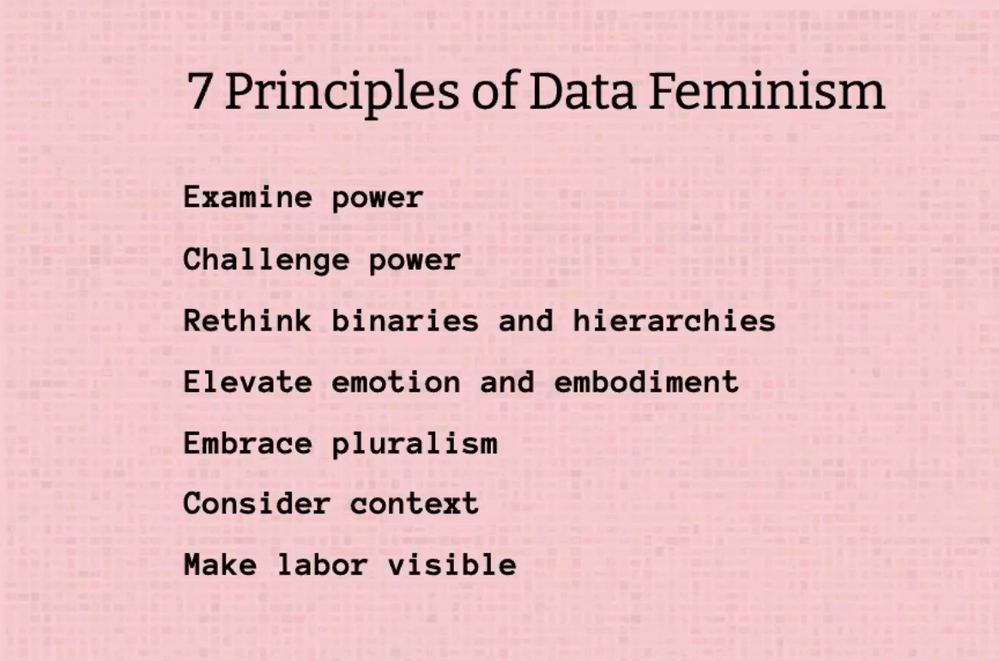

class: inverse

.pull-left[

]

.pull-right[
.large[
- Data science by whom?

- Data science for whom?

- Data sets about whom?

- Data science with whose values? 
]
]

---

class: inverse, center, middle

{width = 40%}

---

class: center, middle

.huge[Rethink binaries]

.rhubarb[.larger[How would you redesign the survey question about student's
gender identity?]]

---

.larger[An aura objectivity]

.pull-left[

]

.pull-right[
> "We focus on four conventions which imbue visualizations with a sense of objectivity, transparency and facticity. These include: (a) two-dimensional viewpoints, (b) clean layouts, (c) geometric shapes and lines, (d) the inclusion of data sources."  
>
> _The work that visualization communications do_

]

---

class: center, middle

.huge[Elevate Emotion]

<https://guns.periscopic.com/>

