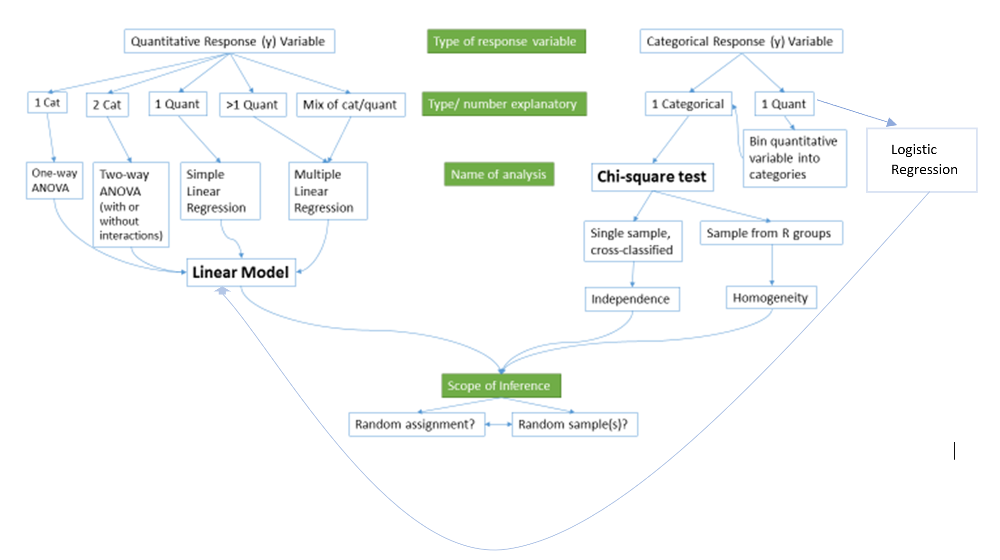
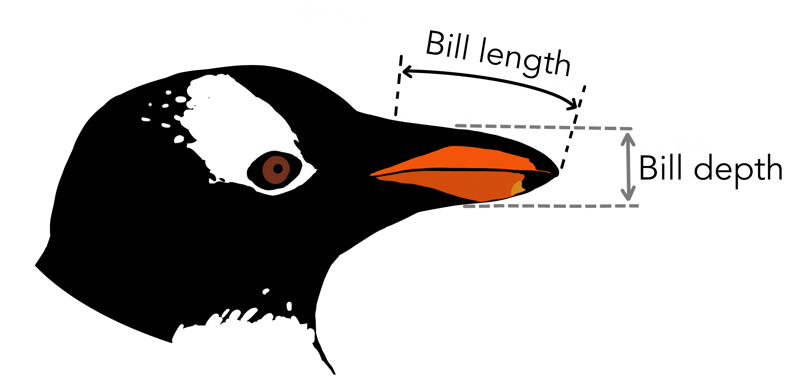

<style type="text/css">
slides > slide:not(.nobackground):after {
  content: '';
}
</style>

```{r setup, include=FALSE}
knitr::opts_chunk$set(warning = FALSE, 
                       message = FALSE)

library(palmerpenguins)
library(tidyverse)
library(flair)
library(gridExtra)
```

## Data Analysis Methods 

<center>
{
width=95% }
</center>

## Dataframe Review 

Data were collected on 344 penguins living on three islands
(Torgersen, Biscoe, and Dream) in the Palmer Archipelago, Antarctica. In 
addition to which island each penguin lives on, the data contains information on
the species of the penguin (Adelie, Chinstrap, or Gentoo), its bill length, bill
depth, and flipper length (measured in millimeters), its body mass (measured in
grams), and the sex of the penguin (female or male).

__What would the dataframe look like?__ 

<center>
{
width=75% }
</center>


## Data Wrangling

- 5 Verbs of Data Wrangling 
  * `filter()` -- filter out/in observations/rows
  * `select()` -- select variables/columns
  * `group_by()` -- group data by a categorical variable 
  * `summarize()` -- create data summaries of variables
  * `arrange()` -- arrange data in descending/ascending order

## Why Wrangle? 

<center>
Wrangling = a reproducible workflow for preparing data for analysis
</center>

</br>
</br>

- Are you interested in analyzing only one level of a categorical variable? 
  Use `filter()`!
- Are you interested in looking at how a relationship changes based on the 
  level of a categorical variable? Use `group_by()`!
- Are you interested in presenting your table of data summaries in a way that 
  makes sense? Use `arrange()`!

## Why Pipe? 

- Clearly express a sequence of multiple operations
- __Improve code read-ability__

```{r wrangle, include = FALSE}
penguins %>%
  filter(sex == "male", year == 2007) %>%
  group_by(species) %>%
  summarize(mean_bill_length = mean(bill_length_mm),
            sd_bill_length = sd(bill_length_mm),
            obs = n()) %>%
  arrange(desc(obs))
```

```{r, echo = FALSE}
decorate("wrangle") %>%
  flair("%>%")
```

```{r, echo = FALSE}
penguins %>%
  filter(sex == "male", year == 2007) %>%
  group_by(species) %>%
  summarize(mean_bill_length = mean(bill_length_mm),
            sd_bill_length = sd(bill_length_mm),
            obs = n()) %>%
  arrange(desc(obs))
```

## Data Summaries, Point Estimates, & Parameters

- Mean: $\bar{x}$ and $\mu$
  * measure the center of a distribution of data
  * not resistant to outliers

- Variance: $s^2$ and $\sigma^2$
  * measure of the spread of a distribution of data
  * not resistant to outliers
  
- Point Estimate: provides our best guess for the value of the parameter  
  * Point estimates based on larger samples tend to be more accurate than those
  based on smaller samples.

## Univariate (One Variable) Visualizations -- For Numerical Data

</br>

- Histogram 

</br>

- Dotplot 

</br>

- Boxplot

</br>

## Histogram

<div class="columns-2">

```{r, message = FALSE, fig.height = 3, fig.width = 3}
penguins %>% 
  ggplot(aes(x = bill_length_mm)) + 
  geom_histogram()
```

</br>

- Higher bars represent where the data are relatively more common 
- Convenient for understanding the shape of the data distribution
- Inspect shape of a distribution (skewed or symmetric) 
- Identify modes

</div>

## Dotplot

<div class="columns-2">

```{r, fig.height = 3, fig.width = 3}
penguins %>% 
  ggplot(aes(x = bill_length_mm)) + 
  geom_dotplot()
```

</br>
</br>
</br>

- One-variable scatterplot

</br>

- __What can you see in the dot plot that you cannot see in the histogram?__

## Boxplot

<div class="columns-2">

```{r, fig.width = 3, fig.height = 5, echo = FALSE}
p1 <- penguins %>% 
  ggplot(aes(x = bill_length_mm)) + 
  geom_dotplot(color = "blue")

p2 <- penguins %>% 
  ggplot(aes(x = bill_length_mm)) + 
  geom_boxplot()

grid.arrange(p1, p2, nrow = 2, ncol = 1)
```

- What calculations are necessary to create a boxplot? 

- What aspects of a variable's distribution are hidden in a boxplot? 

## Density Plot 

<div class="columns-2">

```{r, fig.width = 4, fig.height = 4}
penguins %>% 
  ggplot(aes(x = bill_length_mm)) + 
  geom_density()
```

</br>
</br>
</br>

- A smooth approximation to a variable's distribution 
- Plots density (as a proportion) on the y-axis
- May be easier to see changes in shape or multiple modes 


## Bivariate (Two Variables) Visualizations -- For Numerical Data

</br>
- Side-by-Side Density Plots (Violin Plots)

</br>

- Scatterplots 

</br>

- Faceted Histograms 

## Side-by-Side Boxplots

```{r, fig.width = 4, fig.height = 4, fig.align = "center"}
penguins %>% 
  ggplot(aes(y = bill_length_mm, x = species)) + 
  geom_boxplot()
```

## Side-by-Side Violin Plots

```{r, fig.width = 4, fig.height = 4, fig.align = 'center'}
penguins %>% 
  ggplot(aes(y = bill_length_mm, x = species)) + 
  geom_violin()
```

<!-- - Similar to density plots, but the density plot has been reflected across the  -->
<!-- y-axis -->
<!-- - Easier to see the shape of the distribution -->

## Scatterplots

```{r, fig.width = 4, fig.height = 4, fig.align = 'center'}
penguins %>% 
  ggplot(aes(y = bill_length_mm, x = bill_depth_mm)) + 
  geom_point()
```

## Multivariate Plots 

There are two main methods for adding a third (or fourth) variable into a 
data visualization: 

- Colors: 
  * creates colors for every level of a categorical variable
  * creates a gradient for different values of a quantitative variable

</br>

- Facets: 
  * creates plot windows for every level of a categorical variable
  * labels each sub-plot with the value of the variable

## Colors in Scatterplots

```{r, fig.width = 6, fig.height = 4, fig.align = 'center'}
penguins %>% 
  ggplot(aes(y = bill_length_mm, x = bill_depth_mm, color = species)) + 
  geom_point()
```

## Colors in Violin Plots

```{r, fig.width = 6, fig.height = 4, fig.align = 'center'}
penguins %>% 
  ggplot(aes(y = bill_length_mm, x = species, fill = island)) + 
  geom_violin()
```

## Facets in Scatterplots 

```{r, fig.width = 8, fig.height = 4, fig.align = 'center'}
penguins %>% 
  ggplot(aes(y = bill_length_mm, x = bill_depth_mm, color = sex)) + 
  geom_point() + 
  facet_wrap(~species)
```

## Facets in Violin Plots

```{r, fig.width = 6, fig.height = 4, fig.align = 'center'}
penguins %>% 
  ggplot(aes(x = bill_length_mm, y = species, fill = sex)) + 
  geom_violin() + 
  facet_wrap(~island)
```

## Your Turn!

Suppose researchers were interested in investigating the relationship between 
a penguin's `sex` and their `flipper_length`, specifically for penguins from 
the Biscoe island. 

They are also interested in how this relationship differs by penguin species and
by the year of capture. 

</br>

- __In your group, decide what data wrangling tasks are necessary to prepare the 
data for plotting.__

- __Then, decide what visualization you believe would help address these
researchers' question.__ 
