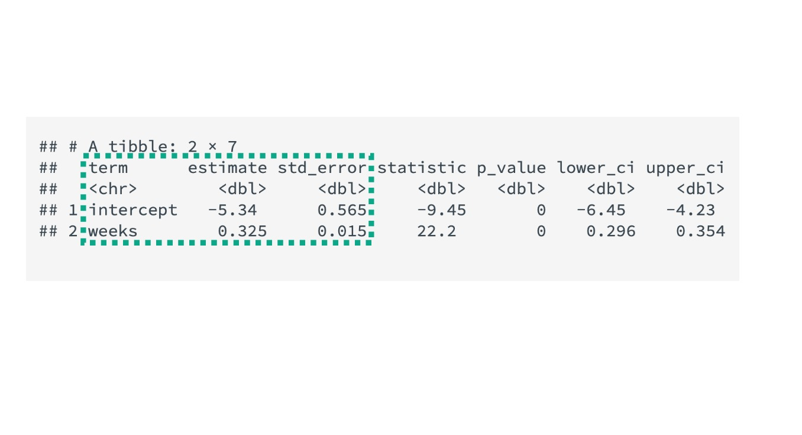

```{r, echo = FALSE, message = FALSE, warning = FALSE}
# R options
options(
  htmltools.dir.version = FALSE,
  tibble.width = 65,
  width = 65
  )

# figure height, width, dpi
knitr::opts_chunk$set(fig.width = 8, 
                      fig.asp = 0.618,
                      out.width = "60%",
                      dpi = 300, 
                      warning = FALSE, 
                      message = FALSE)

# fontawesome
htmltools::tagList(rmarkdown::html_dependency_font_awesome())

# magick
dev.off <- function(){
  invisible(grDevices::dev.off())
}

# xaringanExtra
library(xaringanExtra)
xaringanExtra::use_panelset()

library(emo)
library(tidyverse)
library(openintro)
library(ggridges)
library(flair)
library(flair)
library(broom)
library(gridExtra)
library(kableExtra)
library(png)
library(moderndive)

options(show.signif.stars = FALSE)
```

```{r set-theme, include = FALSE}
library(xaringanthemer)
style_duo_accent(
  primary_color      = "#b76352", # mango
  secondary_color    = "#34605f", # bayberry
  header_font_google = google_font("Raleway"),
  text_font_google   = google_font("Raleway", "300", "300i"),
  code_font_google   = google_font("Source Code Pro"),
  header_color = "#793540", #rhubarb
  white_color = "#F5F5F5", # lightest color
  black_color = "#36454F", # darkest color
  text_font_size = "30px", 
  link_color = "#696969" #grey
)
```

.hand[.larger[Review]]

.pull-left[
```{r, echo = FALSE, out.width = "100%"}
ncbirths %>% 
ggplot(aes(x = weeks, y = weight)) +
  geom_jitter() + 
  labs(x = "Length of pregnancy (in weeks)",
       y = "Birth weight of baby (in lbs)")
```
]

--

.pull-right[
```{r, echo = FALSE, out.width = "100%"}
ncbirths %>% 
ggplot(aes(x = weeks, y = weight, color = premie)) +
  geom_jitter() + 
  labs(x = "Length of pregnancy (in weeks)",
       y = "Birth weight of baby (in lbs)")
```
]

---

.bayberry[.larger[Summarizing a Linear Relationship]]

.pull-left[
- Correlation: __strength and direction of a *linear* relationship between two
*quantitative* variables__

  * Correlation coefficient between -1 and 1
  * Sign of the correlations shows direction
  * Magnitude of the correlation shows strength
]

--

.pull-right[
```{r}
births_post26 <- ncbirths %>% 
  filter(is.na(weight) == FALSE, 
         is.na(weeks) == FALSE, 
         weeks > 26)


births_post26 %>% 
  get_correlation(weeks ~ weight)
```
]

---

class: middle, inverse

.larger[Anscombe Correlations]

<!-- In 1973, statistician Francis Anscombe created a synthetic data set that has -->
<!-- been used extensively to illustrate concepts related to correlation and -->
<!-- regression. -->

.pull-left[
```{r, echo = FALSE, out.width = "100%"}
anscombe <- anscombe %>%
  mutate(id = 1:nrow(.)) %>%
  pivot_longer(cols = -id, names_to = "key", values_to = "value") %>%
  separate(key, into = c("variable", "set"), sep = 1) %>%
  pivot_wider(names_from = variable, values_from = value)

ggplot(data = anscombe, aes(x = x, y = y)) +
  geom_point() +
  facet_wrap(~set)
```
]

.pull-right[

Four datasets, very different graphical presentations  

- same mean and standard deviation in both $x$ and $y$
- same correlation
- same regression line
]

--

.center[
.large[.honey[For which of these relationships is correlation a reasonable summary measure?]]
]

---

class: middle 

.larger[The Importance of Language]

</br>

- The word “correlation” has both a precise mathematical definition and a more general definition for typical usage in English. 

--

- These uses are obviously related and generally in sync.

- There are times when these two uses can be conflated and/or misconstrued.

---

.gray[.larger[Linear Regression]]

- Models are ubiquitous in statistics.

  * We often assume that the value of our response variable is some function of
  our explanatory variable, plus some random noise.
  
--

- In this case, we assume the relationship between $x$ and $y$ takes the form 
of a **linear function**.

</br>

.center[
$$
  response = intercept + slope \cdot explanatory + noise
$$
]


---

class: inverse, middle

.larger[Two Regression Equations]

.large[.pink[Population Regression Model]]

$$
  y_i = \beta_0 + \beta_1 \cdot X + \epsilon_i \,, \qquad \epsilon \sim N(0, \sigma)
$$
</br>

--

.large[.honey[Estimated / Fitted Regression Model]]

$$
  \hat{y} = b_0 + b_1 \cdot x
$$

---

class: middle

.larger[Coefficient Estimates]

```{r}
  
weeks_lm <- lm(weight ~ weeks, data = births_post26)
  
get_regression_table(weeks_lm)
```

---

class: middle, inverse

.larger[Our focus (for now...)]



---

class: center, inverse

.larger[Estimated regression equation]

$$\hat{y} = b_0 + b_1 \cdot x$$

--

.pull-left[
$\hat{y} = \widehat{\text{weight}}$ 
]

--

.pull-right[
$b_0 = -5.34$  

$b_1 = 0.325$

$x = \text{weeks}$ 
]

--

</br>

$$\widehat{\text{weight}} = -5.34 + 0.325 \cdot \text{weeks}$$

---

class: center, middle 

.larger[.hand[Your Turn]]

```{r}
weight_gain_lm <- lm(weight ~ gained, data = births_post26)
  
get_regression_table(weight_gain_lm)
```

</br>

.large[.rhubarb[Write out the estimated regression equation!]]

---

class: inverse, center

.larger[Categorical Explanatory Variables]

.pull-left-narrow[
```{r}
births_post26 %>% 
  distinct(habit)
```
]

--

.pull-right-wide[
```{r}
habit_lm <- lm(weight ~ habit, data = births_post26)
  
get_regression_table(habit_lm)
```
]

--

.large[.honey[What is the estimated mean birth weight for nonsmoking mothers?]]

---

.larger[Indicator Variables]

$$
  \hat{y} = b_0 + b_1 \cdot x
$$

--

.pull-left[
$x$ is a categorical variable
- `"nonsmoker"`
- `"smoker"`
]

--

.pull-right[
Need: 
- "baseline" mean 
- "offsets" 
]

--

</br>

.center[
$1_{smoker}(x) = 1$ if the mother was a `"smoker"`, 0 otherwise
]

--

$$\widehat{\text{weight}} = 7.23 - 0.4 \cdot 1_{smoker}(x)$$
