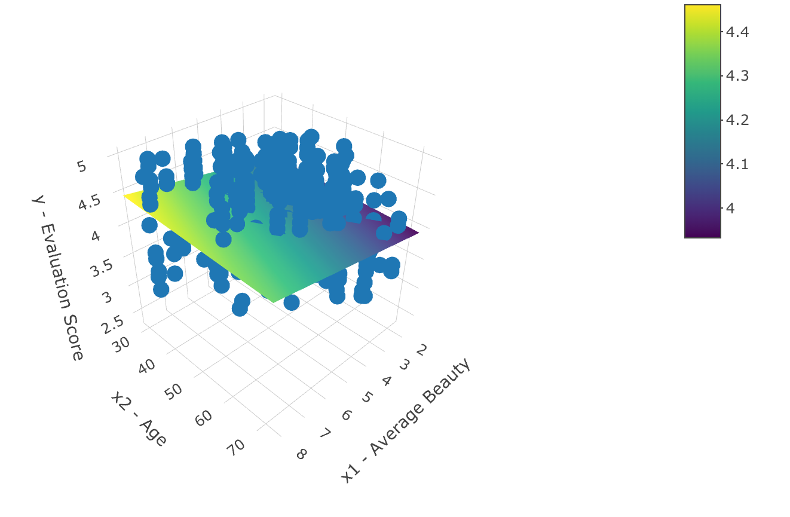

<style type="text/css">
slides > slide:not(.nobackground):after {
  content: '';
}
</style>

```{r setup, include=FALSE}
knitr::opts_chunk$set(warning = FALSE, 
                       message = FALSE, 
                      fig.width = 5, 
                      fig.height = 4, 
                      results = "hold")

options(show.signif.stars = FALSE)
library(tidyverse)
library(moderndive)
library(openintro)
library(flair)
library(broom)
library(gridExtra)
library(kableExtra)

evals <- evals %>% 
  rename(sex = gender)
```

## Simple Linear Regression Review

```{r, echo = FALSE, fig.width = 8, fig.height = 5, fig.align = 'center'}
p1 <- evals %>% 
  ggplot(aes(x = bty_avg, y = score)) + 
  geom_jitter() + 
  geom_smooth(method = "lm") +
  labs(x = "Average Beauty Score", 
       y = "Course Evaluation Score")

p2 <- evals %>% 
  ggplot(aes(x = age, y = score)) + 
  geom_jitter() + 
  geom_smooth(method = "lm") +
  labs(x = "Professor Age", 
       y = "")

grid.arrange(p1, p2, nrow = 1)  
```

## Adding Both Variables to Regression

```{r, eval = FALSE, echo = FALSE}
library(ISLR)
library(plotly)

# setup hideous grid required by plotly
model_lm <- lm(score ~ bty_avg + age, data = evals)
x_grid <- seq(from = min(evals$bty_avg), 
              to = max(evals$bty_avg), 
              length = 100)
y_grid <- seq(from = min(evals$age), 
              to = max(evals$age), 
              length = 200)
z_grid <- expand.grid(x_grid, y_grid) %>%
  as_tibble() %>%
  rename(x_grid = Var1, y_grid = Var2) %>%
  mutate(z = coef(model_lm)[1] + coef(model_lm)[2] * x_grid + coef(model_lm)[3] * y_grid) %>%
  .[["z"]] %>%
  matrix(nrow = length(x_grid)) %>%
  t()

# Plot points
plot_ly() %>%
  add_markers(
    x = evals$bty_avg,
    y = evals$age,
    z = evals$score,
    hoverinfo = "text",
    text = ~ paste(
      "x1 - Average Beauty: ",
      evals$bty_avg,
      "</br> x2 - Age: ",
      evals$age,
      "</br> y - Evaluation Score: ",
      evals$score
    )
  ) %>%
  # Label axes
  layout(
    scene = list(
      xaxis = list(title = "x1 - Average Beauty"),
      yaxis = list(title = "x2 - Age"),
      zaxis = list(title = "y - Evaluation Score")
    )
  ) %>%
  # Add regression plane
  add_surface(
    x = x_grid,
    y = y_grid,
    z = z_grid
  )
```

```{r, echo = FALSE}

```

