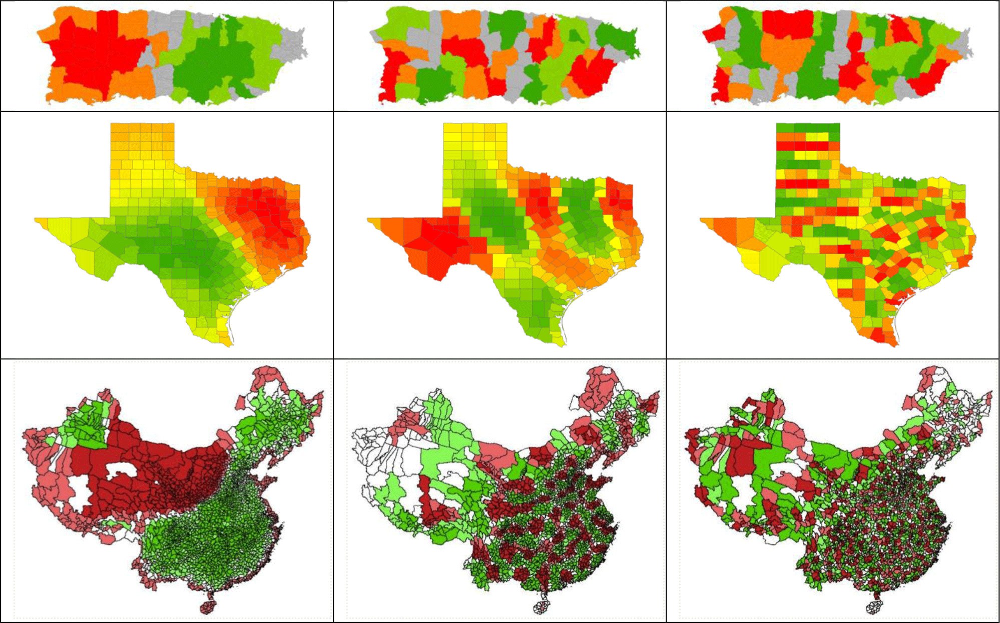
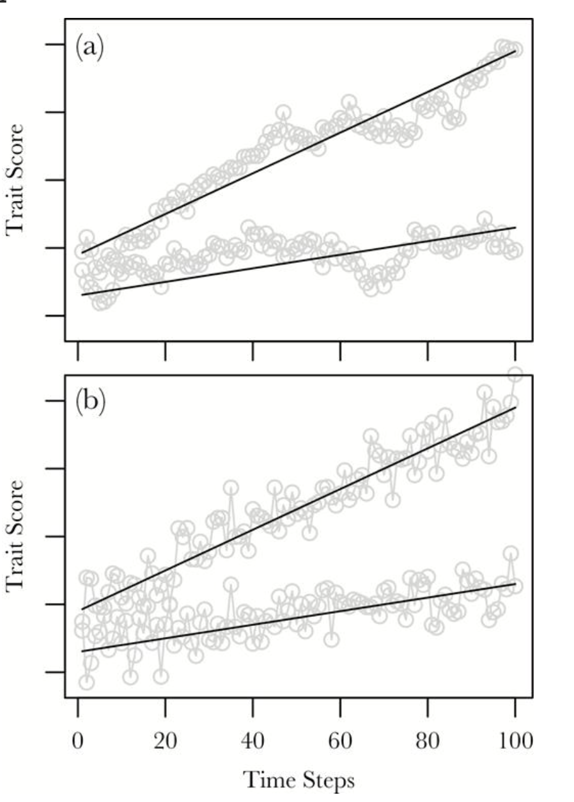
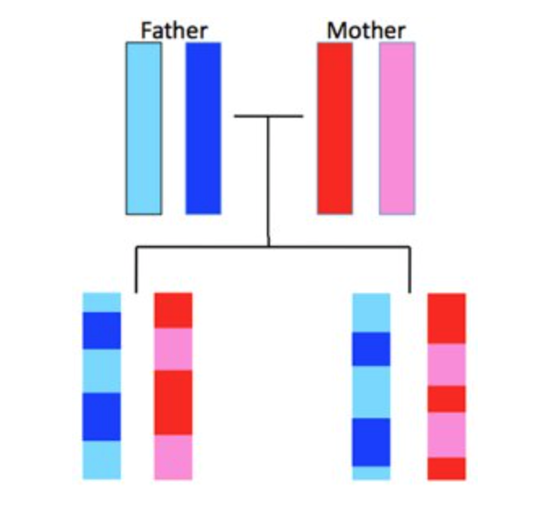
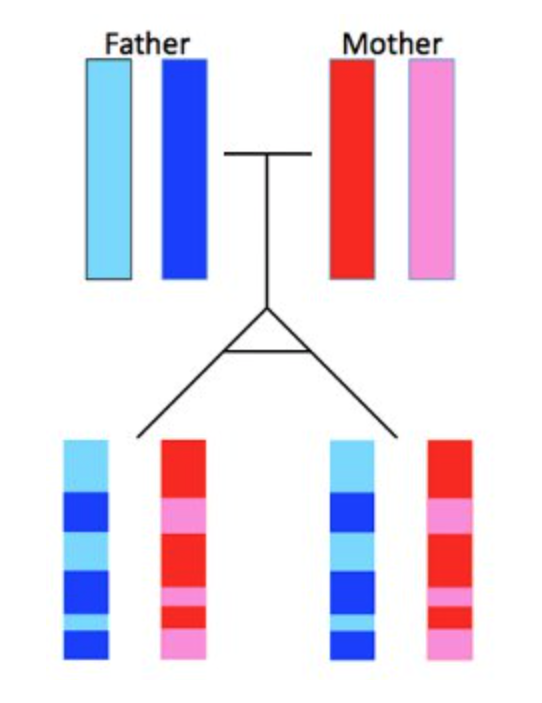

<style type="text/css">
slides > slide:not(.nobackground):after {
  content: '';
}
</style>

```{r setup, include=FALSE}
knitr::opts_chunk$set(warning = FALSE, 
                       message = FALSE, 
                      fig.width = 5, 
                      fig.height = 4,
                      fig.align = "center",
                      results = "hold")

options(show.signif.stars = FALSE)

library(tidyverse)
library(openintro)
```

## What are we assessing? 

<center> 

*Information about one observation does not provide us with perfect information about values for another observation.* 

- Knowing the values of the explanatory and response variables for one observation 
should not give us perfect information about what values we would expect for another observation. 

## Independence Violations 

- Observations are "clustered" 
  * geographically -- spatial correlation
  * time -- temporal correlation 
  * biologically -- genetically 
  
- Multiple observations are recorded for each unit of study
  * repeated measures 
  
## Spatial Correlation

```{r, echo = FALSE, out.width = "70%"}

```

## Temporal Correlation

```{r, echo = FALSE, out.height = "40%", out.width = "40%"}

```

## Biological Correlation 

<div class="columns-2">

</br>

```{r, echo = FALSE}

```

</br> 
</br>

```{r, echo = FALSE}

```


## Repeated Observations 

```{r}
evals %>% 
  count(prof_id, sort = TRUE) 
```

