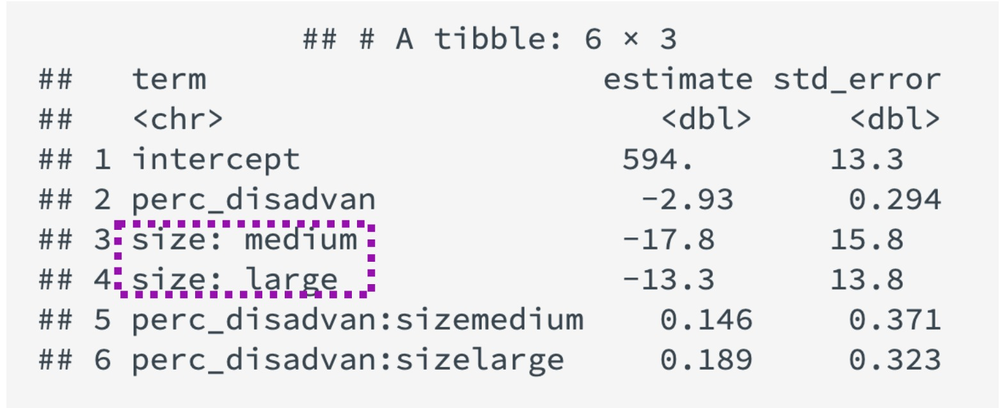
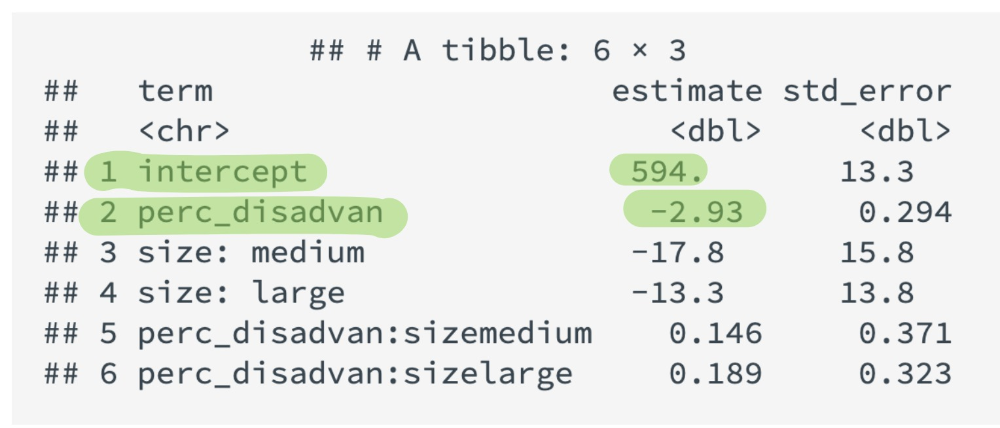
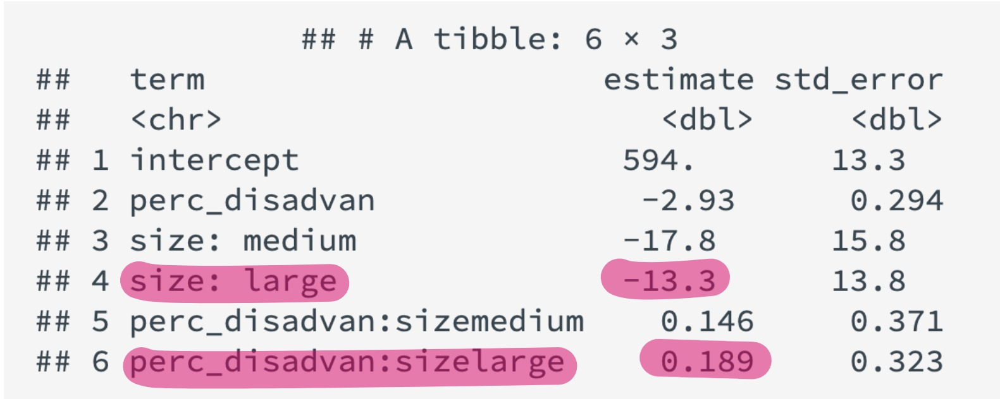

```{r, echo = FALSE, message = FALSE, warning = FALSE}
# R options
options(
  htmltools.dir.version = FALSE,
  tibble.width = 65,
  width = 65
  )

# figure height, width, dpi
knitr::opts_chunk$set(fig.width = 8, 
                      fig.asp = 0.618,
                      out.width = "70%",
                      dpi = 300, 
                      warning = FALSE, 
                      message = FALSE, 
                      fig.align = "center", 
                      echo = FALSE)

# fontawesome
htmltools::tagList(rmarkdown::html_dependency_font_awesome())

# magick
dev.off <- function(){
  invisible(grDevices::dev.off())
}

# xaringanExtra
library(xaringanExtra)
xaringanExtra::use_panelset()

library(emo)
library(tidyverse)
library(openintro)
library(gridExtra)
library(kableExtra)
library(moderndive)

options(show.signif.stars = FALSE)
```

```{r set-theme, include = FALSE}
library(xaringanthemer)
style_duo_accent(
  primary_color      = "#b76352", # mango
  secondary_color    = "#34605f", # bayberry
  header_font_google = google_font("Raleway"),
  text_font_google   = google_font("Raleway", "300", "300i"),
  code_font_google   = google_font("Source Code Pro"),
  header_color = "#793540", #rhubarb
  white_color = "#F5F5F5", # lightest color
  black_color = "#36454F", # darkest color
  text_font_size = "30px", 
  link_color = "#696969" #grey
)
```

class: center 

.larger[**When investigating if a relationship differs...**]

--

.large[.rhubarb[Always start with the "interaction" / different slopes model.]]

--

.large[.mango[If the slopes look different, you're done!]]

--

.large[.grey[If the slopes look similar, then fit the "additive" / parallel slopes model.]] 

---

class: inverse, center

.larger[Different enough?]

.pull-left[
```{r, eval = FALSE, echo = TRUE}
MA_schools %>% 
  ggplot(mapping = aes(y = average_sat_math, 
                       x = perc_disadvan, 
                       color = size)) + 
  geom_point() +
  geom_smooth(method = "lm") 
```

- .large[.mango[geom_smooth()]] allows for *both* the intercepts and the slopes
to differ
]

--

.pull-right[
```{r, out.width = "100%"}
MA_schools %>% 
  ggplot(mapping = aes(y = average_sat_math, x = perc_disadvan, color = size)) + 
  geom_point() +
  geom_smooth(method = "lm") + 
  labs(y = "Average SAT Math Score", 
       x = "Percent of Students Economically Disadvantaged", 
       color = "School Size")
```
]

---

class: middle, center, inverse

.larger[What about now?]

.pull-left[
```{r, eval = FALSE, echo = TRUE}
lm(average_sat_math ~ perc_disadvan * size, 
   data = MA_schools)
```

- The .large[.mango[*]] means the variables are interacting!
]

--

.pull-right[
```{r}
lm(average_sat_math ~ perc_disadvan*size, data = MA_schools) %>% 
  get_regression_table() %>% 
  select(term:std_error)
```
]

---

class: middle, center

.larger[Who is baseline?]

```{r, out.width = "50%"}

```


---

class: center, middle 

.larger[Deciphering groups -- Small schools]

```{r, out.width = "50%"}

```
--

$$\widehat{SAT}_{small} = 594 - 2.93 \times \text{percent disadvantaged}$$

---

class: center, middle 

.larger[Deciphering groups -- Medium schools]

```{r, out.width = "50%"}
knitr::include_graphics("images/medium_coefficients.jpg")
```
--

$$\widehat{SAT}_{medium} = (594 - 17.8) + (- 2.93 + 0.146) \times \text{percent disadvantaged}$$
--

$$\widehat{SAT}_{medium} = 576.2 - 2.784 \times \text{percent disadvantaged}$$

---

class: center, middle

.larger[Deciphering groups -- Large schools]

```{r, out.width = "50%"}

```

--

$$\widehat{SAT}_{large} = (594 - 13.3) + (- 2.93 + 0.189) \times \text{percent disadvantaged}$$

--

$$\widehat{SAT}_{medium} = 580.7 - 2.741 \times \text{percent disadvantaged}$$

---

class: middle, center, inverse

.larger[What if they're not different?]

.pull-left[
```{r, eval = FALSE, echo = TRUE}
MA_schools %>% 
  ggplot(mapping = aes(y = average_sat_math, 
                       x = perc_disadvan, 
                       color = size)) + 
  geom_point() +
  geom_parallel_slopes() 
```
]

.pull-right[
```{r, out.width = "100%"}
MA_schools %>% 
  ggplot(mapping = aes(y = average_sat_math, x = perc_disadvan, color = size)) + 
  geom_point() +
  geom_smooth(method = "lm") + 
  labs(y = "Average SAT Math Score", 
       x = "Percent of Students Economically Disadvantaged", 
       color = "School Size")
```

]

---

class: middle

.larger[Parallel Slopes]

.pull-left[
```{r, eval = FALSE, echo = TRUE}
lm(average_sat_math ~ perc_disadvan + size, 
   data = MA_schools)
```

- The .large[.mango[+]] means the variables **are not** interacting!
]

--

.pull-right[
```{r}
lm(average_sat_math ~ perc_disadvan + size, data = MA_schools) %>% 
  get_regression_table() %>% 
  select(term:std_error)
```
]

---

class: inverse, center, middle

.larger[Group equations -- Baseline]

```{r}
lm(average_sat_math ~ perc_disadvan + size, data = MA_schools) %>% 
  get_regression_table() %>% 
  select(term:std_error)
```

--

$$\widehat{SAT}_{small} = 588 - 2.78 \times \text{percent disadvantaged}$$

---

class: inverse, center, middle

.larger[Group equations -- Offsets]

```{r}
lm(average_sat_math ~ perc_disadvan + size, data = MA_schools) %>% 
  get_regression_table() %>% 
  select(term:std_error)
```

--

$$\widehat{SAT}_{medium} = (588 - 11.9) - 2.78 \times \text{percent disadvantaged}$$
--

$$\widehat{SAT}_{medium} = 576.1 - 2.78 \times \text{percent disadvantaged}$$


--

$$\widehat{SAT}_{large} = (588 - 6.36) - 2.78 \times \text{percent disadvantaged}$$

--

$$\widehat{SAT}_{large} = 581.64 - 2.78 \times \text{percent disadvantaged}$$


