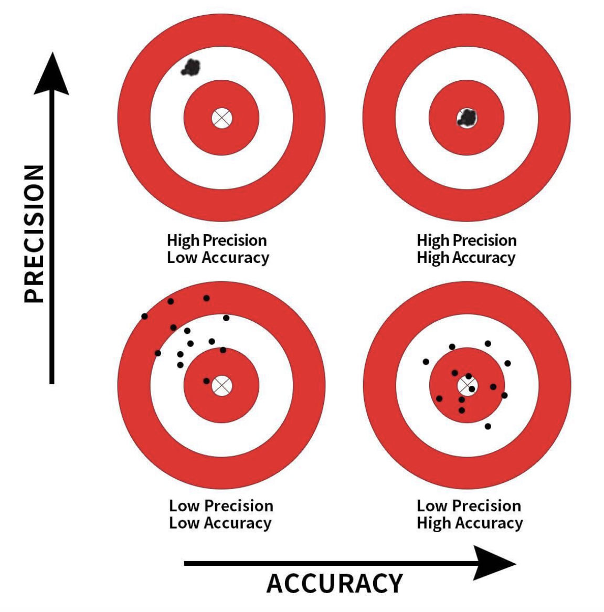

<style type="text/css">
slides > slide:not(.nobackground):after {
  content: '';
}
</style>

```{r setup, include=FALSE}
knitr::opts_chunk$set(warning = FALSE, 
                      echo = FALSE, 
                      fig.width = 4, 
                      fig.height = 4, 
                      message = FALSE)
library(tidyverse)
library(openintro)
library(gridExtra)
library(moderndive)
library(infer)
```


## Precision & Accuracy 

```{r,fig.align='center', out.width= "60%", echo = FALSE}

```

##

In general:

- If the sampling of a sample of size $n$ is done at random, then
- the sample is unbiased and representative of the population of size $N$, thus
- any result based on the sample can generalize to the population, thus
- the point estimate is a “good guess” of the unknown population parameter, thus
- instead of performing a census, we can infer about the population using sampling.