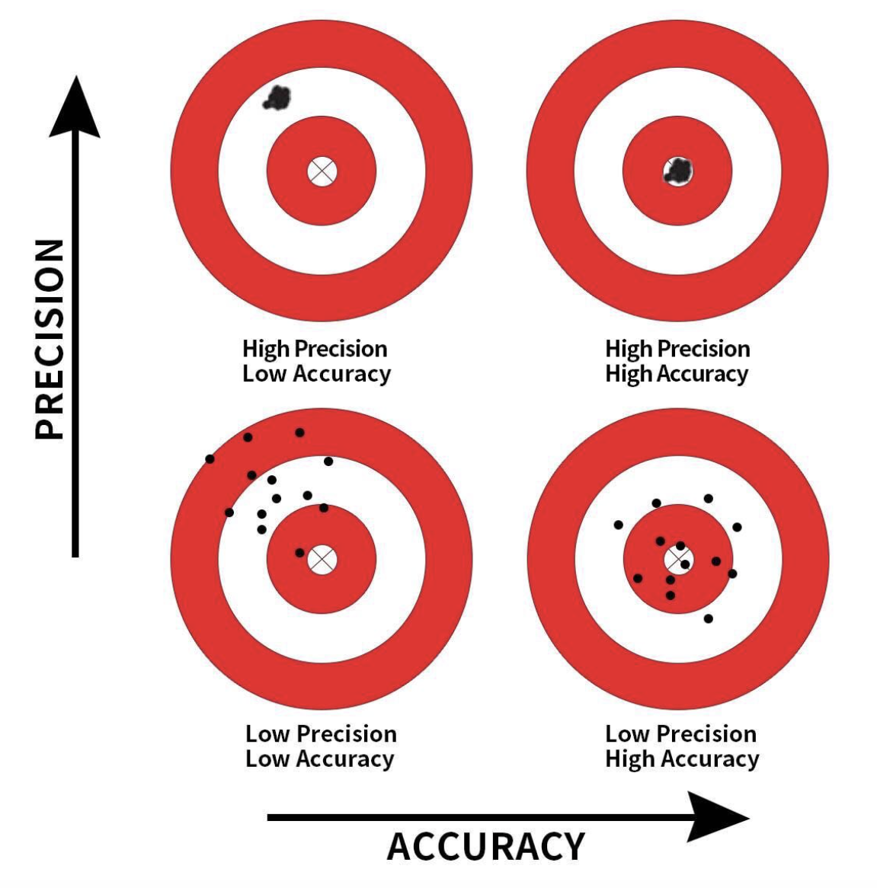

<style type="text/css">
slides > slide:not(.nobackground):after {
  content: '';
}
</style>

```{r setup, include=FALSE}
set.seed(12345)
knitr::opts_chunk$set(warning = FALSE, 
                       message = FALSE, 
                      fig.width = 5, 
                      fig.height = 4, 
                      results = "hold")

options(show.signif.stars = FALSE)
library(tidyverse)
library(moderndive)
library(openintro)
library(flair)
library(broom)
library(gridExtra)
library(kableExtra)
library(randomNames)
```

## Data Context

Election news is everywhere we look, but gives us an amazing context to explore 
sampling variability. 

```{r,fig.align='center', out.width= "80%", echo = FALSE}
knitr::include_graphics("wide_poll.png")
```

## Sampling 

We may be interested in the proportion of US citizens voting for a particular 
candidate, however it is unreasonable to sample every citizen. 

- We take a sample of individuals, with the interest in inferring what we found 
in our sample to a larger population of individuals. 

- We typically only get one sample, but repeated sampling gives us a better idea 
of the variation in responses. 


```{r, echo = FALSE}

polling <- tibble(name = randomNames(30, which.names = "first"), 
                        biden = rbinom(n = 30, size = 1, prob = 0.522)) %>% 
  mutate(biden = if_else(biden == 0, "no", "yes"))
```

## Sampling Variation

<div class="columns-2">

```{r, echo = FALSE}
polling
```

```{r}
polling %>% 
  count(biden)
```


## Virtual Sampling 

```{r, echo = FALSE, cache=TRUE}
polling_large <- tibble(name = randomNames(2500, which.names = "first"), 
                        candidate = rbinom(n = 2500, size = 1, prob = 0.522)) %>% 
  mutate(candidate = if_else(candidate == 0, "Trump", "Biden")
         )
```

Technically there are approximately 250,056,000 people in the US who are of 
voting age. If we had a record of every person and their vote, we could take 
repeated samples from this database of votes. 

```{r}
virtual_poll <- polling_large %>% 
  rep_sample_n(size = 50, reps = 1000)
```

```{r, echo = FALSE}
virtual_poll
```


## Distribution of Proportions for Multiple Samples

<div class="columns-2">

```{r, echo = FALSE}
virtual_poll %>% 
  group_by(replicate) %>% 
  summarize(n_biden = sum(candidate == "Biden")) %>% 
  mutate(prop_biden = n_biden / 50) 
```

```{r, echo = FALSE, fig.width=3}
virtual_poll %>% 
  group_by(replicate) %>% 
  summarize(n_biden = sum(candidate == "Biden")) %>% 
  mutate(prop_biden = n_biden / 50) %>% 
  ggplot(aes(x = prop_biden)) + 
  geom_histogram(bins = 12)
```

## Sampling Distributions 

- Visualize the effect of sampling variation on the distribution of any point
estimate -- in this case, the sample proportion  

<div class="columns-2">

```{r, echo = FALSE, fig.width = 4, fig.height=4}
virtual_poll %>% 
  group_by(replicate) %>% 
  summarize(n_biden = sum(candidate == "Biden")) %>% 
  mutate(prop_biden = n_biden / 50) %>% 
  ggplot(aes(x = prop_biden)) + 
  geom_dotplot(dotsize = 0.25, color = "blue") + 
  labs(title = "1000 Samples of Size 50")
```

</br> 

```{r, echo = FALSE, fig.width = 8, fig.height=4}

polling %>% 
  count(biden)

```

## Distribution of Proportions for Different Sample Sizes

```{r, echo = FALSE, warning=FALSE, message=FALSE}
poll_25 <- polling_large %>% 
  rep_sample_n(size = 25, reps = 1000) %>% 
  group_by(replicate) %>% 
  summarize(n_biden = sum(candidate == "Biden")) %>% 
  mutate(prop_biden = n_biden / 25) 

poll_50 <- polling_large %>% 
  rep_sample_n(size = 50, reps = 1000) %>% 
  group_by(replicate) %>% 
  summarize(n_biden = sum(candidate == "Biden")) %>% 
  mutate(prop_biden = n_biden / 50) 

poll_100 <- polling_large %>% 
  rep_sample_n(size = 100, reps = 1000) %>% 
  group_by(replicate) %>% 
  summarize(n_biden = sum(candidate == "Biden")) %>% 
  mutate(prop_biden = n_biden / 100) 
```

```{r, echo = FALSE, fig.width = 8}
plot_25 <- poll_25  %>% 
  ggplot(aes(x = prop_biden)) + 
  geom_histogram(bins = 15) + 
  xlim(c(0.1, 0.9)) +
  labs(title = "Sample Size 25")

plot_50 <- poll_50  %>% 
  ggplot(aes(x = prop_biden)) + 
  geom_histogram(bins = 15) + 
  xlim(c(0.1, 0.9)) +
  labs(title = "Sample Size 50")

plot_100 <- poll_100 %>% 
  ggplot(aes(x = prop_biden)) + 
  geom_histogram(bins = 15) + 
  xlim(c(0.1, 0.9)) +
  labs(title = "Sample Size 100")


grid.arrange(plot_25, plot_50, plot_100, nrow = 1)

```


## Standard Deviations for Different Sample Sizes 

```{r, echo = FALSE, eval = FALSE}

sds <- poll_25 %>% 
  summarize(mean = mean(prop_biden), 
            sd = sd(prop_biden))

sds <-  rbind(sds, 
        poll_50 %>% 
  summarize(mean = mean(prop_biden), 
            sd = sd(prop_biden)))

sds <-  rbind(sds, 
        poll_100 %>% 
  summarize(mean = mean(prop_biden), 
            sd = sd(prop_biden)))
```

| Sample Size | Estimate | SD     |
| ----------- |:--------:| ------:|
| n = 25      | 0.534    | 0.0986 |
| n = 50      | 0.529    | 0.0720 |
| n = 100     | 0.527    | 0.0489 |


## Sampling Concepts 

- A __population__ is a collection of individuals or observations we are interested in. 
  * A population __parameter__ is a numerical summary quantity about the population that is unknown, but you wish you knew.

</br> 

- __Sampling__ is the act of collecting a sample from the population when we don’t have the means to perform a census.
  * A __point estimate__ is a summary statistic computed from a sample that estimates an unknown population parameter. 

## Sampling Procedures 

- A __census__ is an exhaustive enumeration or counting of all individuals. 

- A __representative sample__ is a sample that looks roughly like the population. 

- A __random sample__ is a sample where every observation has the same probability of selection. 

- A __biased sample__ is a sample where certain individuals or observations in a population have a higher chance of being included than others. 

- __Generalizability__ is when the results from a sample can be _inferred_ to the population. 


## Precision & Accuracy 

```{r,fig.align='center', out.width= "60%", echo = FALSE}

```


## Your Turn 

For the project, you are investigating data on student graduation and receipt of
grants. The data come from every accredited college and university in the US & 
Puerto Rico. 

In your project groups address the following questions: 

- Who is the study population?
- What type of sample was collected?  
- What is the population parameter?  
- What is your point estimate / sample statistic? 
- Are the samples generalizable to the greater population? 
- 
