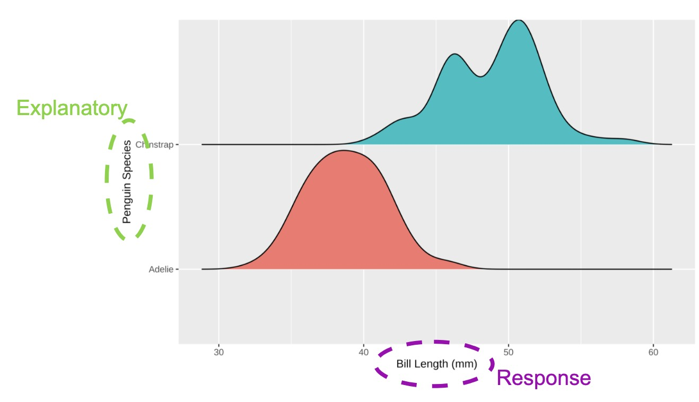

```{r, echo = FALSE, message = FALSE, warning = FALSE}
# R options
options(
  htmltools.dir.version = FALSE,
  tibble.width = 65,
  width = 65
  )

# figure height, width, dpi
knitr::opts_chunk$set(fig.width = 8, 
                      fig.asp = 0.618,
                      out.width = "60%",
                      dpi = 300, 
                      warning = FALSE, 
                      message = FALSE, 
                      fig.align = "center",
                      echo = FALSE)

# fontawesome
htmltools::tagList(rmarkdown::html_dependency_font_awesome())

# magick
dev.off <- function(){
  invisible(grDevices::dev.off())
}

# xaringanExtra
library(xaringanExtra)
xaringanExtra::use_panelset()

library(emo)
library(tidyverse)
library(openintro)
library(ggridges)
library(flair)
library(broom)
library(gridExtra)
library(kableExtra)
library(png)
library(moderndive)
library(infer)
library(scales)

options(show.signif.stars = FALSE)
```

```{r set-theme, include = FALSE}
library(xaringanthemer)
style_duo_accent(
  primary_color      = "#b76352", # mango
  secondary_color    = "#34605f", # bayberry
  header_font_google = google_font("Raleway"),
  text_font_google   = google_font("Raleway", "300", "300i"),
  code_font_google   = google_font("Source Code Pro"),
  header_color = "#793540", #rhubarb
  white_color = "#F5F5F5", # lightest color
  black_color = "#36454F", # darkest color
  text_font_size = "30px", 
  link_color = "#696969" #grey
)
```

class: center, middle, inverse

.hand[.huge[What if I only have one sample?]]

---

class: center, middle 

.larger[Approximate the variability you'd expect to see in other samples!] 

<!-- make a connection between sampling distributions and the approximations we use -->

--

.larger[**Bootstrapping!**]

---

class: middle 

.larger[A Bootstrap Resample]

--

Assumes the original sample is "representative" of observations in the
population. 

--

Uses the original sample to generate new samples that might have occurred with 
additional sampling. 

--

.dark-blue[We can use the statistics from these bootstrap samples to approximate
the true sampling distribution!]

---

class: center, middle, inverse

.hand[.huge[Why???]]

---

class: middle

.larger[Estimating a population parameter]

--

.grey[We are interested in knowing how a statistic varies from sample to 
sample.]

--

.bayberry[Knowing a statistic's behavior helps us make better / more informed
decisions!]

--

.rhubarb[This helps us estimate what values are more or less likely for the 
population parameter to have.]

---

class: inverse, center

.huge[Confidence Intervals]

--

.large[Capture a range of plausible values for the population parameter.]

--

.large[Are more likely to capture the population parameter than a *point
estimate*.]

---

class: middle

.larger[Using bootstrap resamples to generate a confidence interval]

--

From your original sample, resample with replacement the same number of times 
as your original sample. 

--

<center>
This is your .pink[bootstrap resample]. 
</center>

--

Repeat this process many, many times. 

--

Calculate a numerical summary (e.g., mean, median) for each bootstrap 
resample. 

--

<center>
These are your .pink[bootstrap statistics]. 
</center>


---

class: inverse, center

.larger[Bootstrap Distribution]

--

.large[*definition*: a distribution of the .pink[bootstrap statistics] from every .pink[bootstrap resample]].

--

.large[Displays the variability in the statistic that could have happened with 
repeated sampling.] 

--

.large[.mango[Approximates the true sampling distribution!]]

---

```{r bootstraps, cache = TRUE}
boot1 <- penguins %>%
  filter(species != "Gentoo") %>% 
  specify(response = bill_length_mm, explanatory = species) %>% 
  generate(reps = 5000, type = "bootstrap") %>% 
  calculate(stat = "diff in means") 

boot1_CI <- get_confidence_interval(boot1, level = 0.95, type = "percentile") 
```

class: center, middle, inverse

.huge[Confidence Interval]

.larger[.pink[Goal:]] .large[Capture a range of plausible values for the population parameter.]

---

class: center, middle

.larger[.hand[How do I get this plausible range of values?]] 

--

.larger[.bayberry[Bootstrapping!]]

---

class: center

.larger[Penguins!]

.pull-left[ .large[**Adelie**] 
```{r, out.width = "50%"}
knitr::include_graphics("images/adelie_penguin.jpg")
```
]

.pull-right[ .large[**Chinstrap**]

]

---

class: middle, inverse, center

.larger[Statistic: difference in means]

```{r}
penguins %>% 
  filter(species != "Gentoo") %>% 
  ggplot(mapping = aes(y = species, x = bill_length_mm, fill = species)) + 
  geom_density_ridges(scale = 1) + 
  theme(legend.position = "none") + 
  labs(x = "Bill Length (mm)",
       y = "Penguin Species")
```

---

class: middle

.larger[Generating a bootstrap resample]

.large[__Step 1:__ `specify()` your response and explanatory variables] 

--

.large[__Step 2:__ `generate()` bootstrap resamples]

--

.large[__Step 3:__ `calculate()` the statistic of interest]

---

class: center

.larger[Declare your variables!]

```{r specify, echo = FALSE, eval = FALSE}
penguins %>% 
  specify(response = bill_length_mm, explanatory = species)
```

```{r}
decorate_chunk("specify", eval = FALSE, echo = TRUE) %>% 
  flair(pattern = "specify")
```

```{r, out.width = "50%"}

```

---

class: center

.larger[Generate your resamples!]

```{r generate, echo = FALSE, eval = FALSE}
penguins %>% 
  specify(response = bill_length_mm, 
          explanatory = species) %>% 
  generate(reps = 1, type = "bootstrap")
```

```{r}
decorate_chunk("generate", eval = FALSE, echo = TRUE) %>% 
  flair(pattern = "generate") %>% 
  flair(pattern = "reps", color = "pink") %>% 
  flair(pattern = '"bootstrap"', color = "purple")
```

--

.pull-left[
.large[`r flair("reps", pattern = "reps", color = "pink")` -- the number of resamples you want to generate]
]

.pull-right[
.large[`r flair('"bootstrap"', pattern = '"bootstrap"', color = "purple")` -- the method that should be used to generate the new samples]
]

---

class: middle, center, inverse 

.larger[Your turn!]

.large[Why do we resample *with replacement* when creating a bootstrap
distribution?]

.large[When we resample with replacement from our original sample what
are we assuming about our sample?]

---

class: center

.larger[Calculate your statistics!]

```{r calculate, echo = FALSE, eval = FALSE}
penguins %>% 
  specify(response = bill_length_mm, 
          explanatory = species) %>% 
  generate(reps = 1, type = "bootstrap") %>% 
  calculate(stat = "diff in means")
```

```{r}
decorate_chunk("calculate", eval = FALSE, echo = TRUE) %>% 
  flair(pattern = "calculate") %>% 
  flair(pattern = '"diff in means"', color = "purple")
```

--

.large[`r flair('"diff in means"', pattern = '"diff in means"', color = "purple")` -- the `stat`istic of interest]

---

class: center, middle, inverse

.larger[The final product]

```{r, out.width = "70%"}
boot1 %>% 
  ggplot(mapping = aes(x = stat)) +
  geom_histogram(binwidth = 0.3, color = "white") + 
  labs(title = "", 
       x = "Difference in Mean Bill Length (mm) -- Adelie - Chinstrap")
```

---

class: middle, center, inverse 

.larger[Your turn!]

.large[.honey[What does one dot / point on a bootstrap distribution represent?]]

---

class: center 

.larger[A plausible range of values for:] 

$$\mu_{\text{adelie}} - \mu_{\text{chinstrap}}$$
```{r, echo = FALSE}
visualise(boot1) +
  shade_confidence_interval(endpoints = boot1_CI, 
                            color = "red", fill = "pink") +
  labs(title = "", 
       x = "Difference in Mean Bill Length (mm) -- Adelie - Chinstrap")
```

---

class: center, middle

.larger[The 95% confidence interval is...]

```{r, echo = FALSE}
get_confidence_interval(boot1, level = 0.95, type = "percentile") %>% 
  mutate(lower_ci = round(lower_ci, 2), upper_ci = round(upper_ci, 2)) %>% 
  kable(col.names = c("Lower Bound", "Upper Bound")) %>% 
  kable_styling()
```

--

.larger[**What do we hope is captured by this interval?**]

---

class: middle, center

.larger[How do we interpret this interval?]

--

> "We are 95% confident the true difference in mean bill length lies between 
> -10.93 and -9.16, when taking Adelie - Chinstrap. 

--

.larger[**What does it mean to be 95% confident?**]

---

class: middle, inverse

.larger[Classic interpretation mistakes]

</br> 

> "95% of the time the population parameter would fall between -10.93 and
> -9.16."

</br>
--

</br>

> "We are 95% confident the sample statistic is in our interval." 

---

class: inverse, center, middle

.larger[.mango[Exit ticket]]

.large[Suppose someone in your team says the following:

> "There is a 95% probability that our 95% confidence interval contains the
> population parameter." 

What do part(s) of their interpretation are correct? 

What part(s) are incorrect? 

]