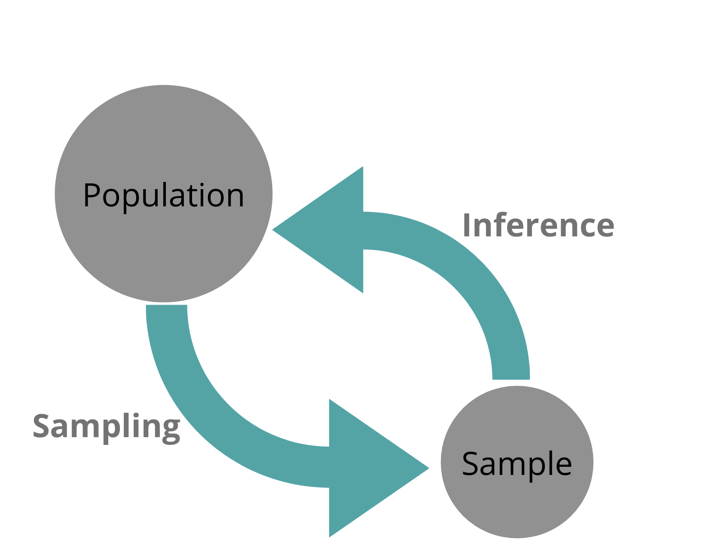
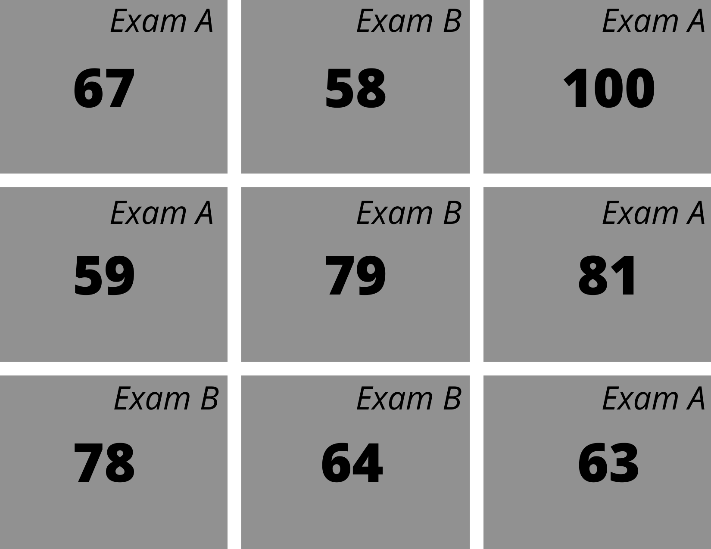
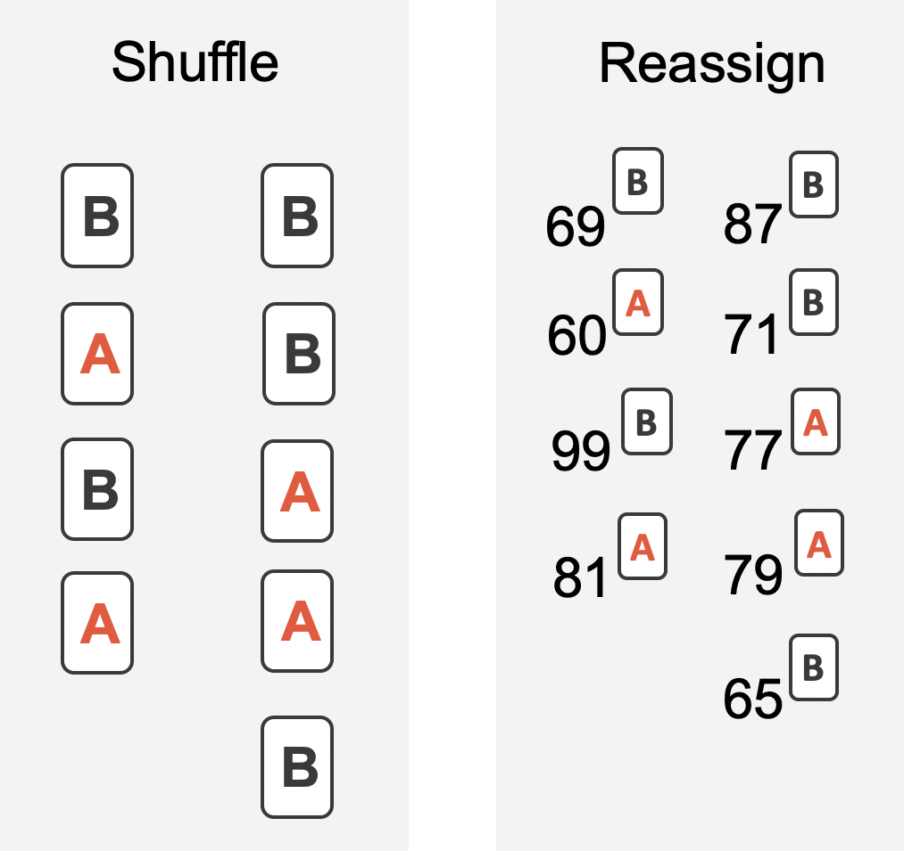
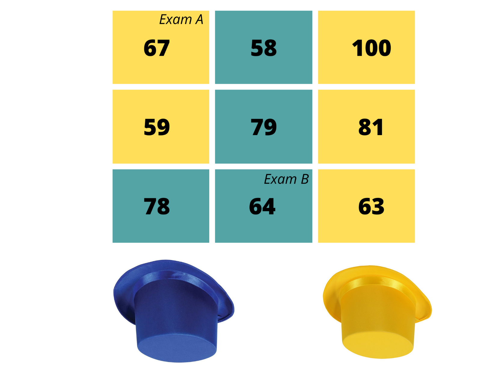

<style type="text/css">
slides > slide:not(.nobackground):after {
  content: '';
}
</style>

```{r setup, include=FALSE}
set.seed(12345)
knitr::opts_chunk$set(warning = FALSE, 
                       message = FALSE, 
                      fig.width = 5, 
                      fig.height = 4, 
                      results = "hold")

options(show.signif.stars = FALSE)

library(knitr)
library(tidyverse)
library(openintro)
library(infer)
library(flair)
library(gridExtra)
library(kableExtra)
```


<!-- <div class="columns-2"> -->

## Recall: Sampling Variability 

Visualize the effect of sampling variation on the distribution of **any** point
estimate -- in this case, the sample slope  

```{r, echo = FALSE, fig.width = 4, fig.height = 4, fig.align = 'center'}
evals %>% 
  specify(formula = score ~ age) %>%
  generate(reps = 1000, type = "bootstrap") %>% 
  calculate(stat = "slope") %>% 
  ggplot(aes(x = stat)) + 
  geom_dotplot(dotsize = 0.3, color = "blue") + 
  theme(axis.title.y = element_blank(), 
        axis.text.y = element_blank()) + 
  labs(y = "", 
       x = "Slope on Age")
```

## Statistical Inference

```{r, echo = FALSE, out.width = "70%", fig.align = "center"}

```


## Using Sampling Variability for Statistical Inference

We will use the idea of sampling variability for statistical inference in two ways. 

1. To make a "null" distribution 

  _Generate samples we would have expected to see if the null hypothesis was true._ 

2. To make a "bootstrap" distribution 

  _Generate other samples we would have collected, assuming our sample is representative of the population._ 


## Difference in Means  

An instructor decided to run two slight variations of the same exam. Prior to
passing out the exams, she shuffled the exams together to ensure each student
received a random version.

Anticipating complaints from students who took Version B, she would like to
evaluate whether the difference observed in the groups is so large that it
provides convincing evidence that Version B was more difficult (on average) than
Version A.

<center>
__Construct hypotheses to evaluate whether the observed difference in sample
means, $\bar{x}_A - \bar{x}_B = 3.1$, is due to chance.__ 

(We will later evaluate these hypotheses using $\alpha = 0.01$.)


## Observed data

```{r echo = FALSE, include = FALSE}
data(classdata)

classdata %>% 
  filter(lecture %in% c("a", "b")) %>%
  group_by(lecture) %>%
  skimr::skim(m1)
```

<center> 

```{r boxplotTwoVersionsOfExams, warning=FALSE, fig.width=7, echo = FALSE}
classdata %>%
  filter(lecture %in% c("a", "b")) %>%
  mutate(exam = lecture) %>%
  ggplot(aes(x = exam, y = m1, color = exam)) +
  geom_boxplot() +
  geom_jitter(width = 0.2) +
  theme(legend.position = "none") +
  labs(x = "Exam", 
       y = "Score")
```

__Do you believe that exam B was more difficult than exam A?__


## Summary Statistics

```{r summaryStatsForTwoVersionsOfExams, echo = FALSE}
temptbl <- tribble(
 ~variable, ~col0,    ~col1, ~col2, ~col3, ~col4,
 "A", 58, 75.1, 13.9, 44, 100,
 "B", 55, 72.0, 13.8, 38, 100
)

temptbl %>%
 kable(caption = "Summary statistics of scores for each exam version.",
    col.names = c("", "$n$", "$\\bar{x}$", "s", "minimum", "maximum")) %>%
 kable_styling() 
```

</br> 

__Do you believe that exam B was more difficult than exam A?__

## Population Parameter 

- A **parameter** is the "true" value of interest.

- We estimate the parameter using a point estimate from a sample of data. 

__What would our parameter be in this example?__


## Randomization & Variability 

A randomized experiment is done to assess whether or not one variable (the
explanatory variable) causes changes in a second variable (the response
variable).

-  Is variability due to the causal mechanism (the randomized explanatory
variable)?

- Or is it instead natural variability inherent to the data? 

- To decide what is the source of the variability, we set-up a sham experiment. 


## Randomization Distributions -- Sham Experiments

```{r, echo = FALSE, out.width = "70%", fig.align = "center"}

```

<!-- - We assume that each observational unit would have gotten the exact same  -->
<!-- response value regardless of whether they received the treatment.  -->

<!-- - We then reassign the treatments many many times and compare the results from  -->
<!-- the actual experiment to the sham experiments. -->


<!-- - If the actual experiment has more extreme results than any of the sham -->
<!-- experiments, we are led to believe that it is the explanatory variable which -->
<!-- is causing the result and not inherent data variability.  -->


## The Role of the Null Hypothesis 

- The shuffling process assumes the null hypothesis is true -- that there is no
effect of the treatment 

  * In this example, the null hypothesis is that exam A and exam B are equally
  difficult. 

  * We expect that students' score on each exam should represent their true
  ability on that material -- it shouldn't matter which exam they took.

</br> 

__If the null hypothesis is true, what is the expected value for $\mu_A - \mu_B$?__   


## Shuffling the Data

<center>

```{r rand2means, warning = FALSE,  out.width="50%", echo = FALSE, fig.align = "center"}

```


## Building a Null Distribution 

- For every shuffle, we calculate the re-randomized difference in means 
($\bar{x}_A - \bar{x}_B$). 
- A distribution of these statistics gives us an idea of the variability we'd 
expect to happen just by chance, _if the null hypothesis is true_. 

```{r randexams, warning = FALSE, fig.width = 6, echo = FALSE, fig.align='center', fig.height=3.5}
set.seed(47)
classdata %>% filter(lecture %in% c("a", "b")) %>%
  specify(m1 ~ lecture) %>%
  hypothesize(null = "independence") %>%
  generate(reps = 1000, type = "permute") %>%
  calculate(stat = "diff in means", order = c("a", "b")) %>% 
  visualize() +
  labs(title = "", 
       x = "Difference in Means (A - B)")
```

## Calculating the p-value

```{r, echo = FALSE, message=FALSE, warning=FALSE}
null <- classdata %>% 
  filter(lecture %in% c("a", "b")) %>%
  specify(m1 ~ lecture) %>%
  hypothesize(null = "independence") %>%
  generate(reps = 1000, type = "permute") %>%
  calculate(stat = "diff in means", order = c("a", "b")) 

obs_diff <- classdata %>% 
  filter(lecture %in% c("a", "b")) %>%
  specify(m1 ~ lecture) %>%
  calculate(stat = "diff in means", order = c("a", "b")) %>% 
  pull()
```

<center> 

```{r, echo = FALSE, message=FALSE, warning=FALSE}
null %>% 
  visualise() + 
  shade_p_value(obs_stat = obs_diff, direction = "greater") + 
  labs(title = "", 
       x = "Difference in Means (A - B)")
```

__Does our observed statistic seem unlikely to have occurred if the exams were equally difficult?__ 

## Making a Decision

```{r, eval = FALSE}
null %>% 
  get_p_value(obs_stat = obs_diff, direction = "greater")
```

```{r, echo = FALSE}
null %>% 
  get_p_value(obs_stat = obs_diff, direction = "greater") %>% 
  pull()
```

- We specified that we would use $\alpha = 0.01$.

- Since the p-value is larger than $\alpha$, we do not reject the null hypothesis. 

- We conclude that the data do not provide convincing evidence that exam B is
more difficult than exam A. 

__Is this the same as proving that exam A and exam B are equally difficult?__ 


## Confidence Intervals 

- Hypothesis tests provide "yes" or "no" answers. 

- Confidence intervals provide "how much" answers. 
  * In this scenario, we are instead interested in estimating the unknown value
  of a population parameter.

</br> 

- For this example, a confidence interval can be used to the range of values 
that seem plausible for the difference in the mean exam scores 
($\mu_A - \mu_B$). 

## Bootstraps & Variability 

- As with randomization tests, our goal with bootstrapping is to understand
variability of a statistic.

- Unlike randomization tests, the bootstrap models how a statistic changes from
repeated sampling.  

- How a statistic varies from sample to sample will provide information about
how different a statistic is from the parameter of interest.  

## Obtaining New Samples 

```{r, echo = FALSE, out.width = "70%", fig.align = "center"}

```

<!-- - Very rarely is sampling data is free or extremely cheap, so taking repeated -->
<!-- samples from a population is usually impossible.  -->

<!--   * Instead of using a "resample from the population" approach, bootstrapping  -->
<!--   uses a "resample from the sample" approach.  -->


## Assumptions Behind a Bootstrap

- Here, we are assuming that the scores earned on the exam are representative of 
the population of all scores students may have earned on these exams. 


- The process of bootstrapping is applied to *each* group separately. 

  * This assumes the exam scores for each group are representative of all
  possible scores students would have earned on each exam. 
  
## Creating a Bootstrap Distribution

- For every resample, we calculate the difference in means: $\bar{x}_A - \bar{x}_B$

- A distribution of these statistics gives us an idea of the variability we'd 
expect in repeated samples from the population.  

```{r bootexams, warning = FALSE, fig.width = 5, echo = FALSE, fig.align='center', fig.height=3.5}
set.seed(47)
boot <- classdata %>% 
  filter(lecture %in% c("a", "b")) %>%
  specify(m1 ~ lecture) %>%
  generate(reps = 2000, type = "bootstrap") %>%
  calculate(stat = "diff in means", order = c("a", "b"))

boot %>% 
  visualize() + 
  labs(title = "", 
       x = "Difference in Means (A - B")
```

## Calculating a Confidence Interval 

```{r bootviz, warning = FALSE, fig.width = 5, echo = FALSE, fig.align='center', fig.height=3}
set.seed(47)
q2.5 <- quantile(boot$stat, 0.025)
q97.5 <- quantile(boot$stat, 0.975)

boot %>% 
  visualise() + 
  shade_confidence_interval(endpoints = c(q2.5, q97.5), fill = "turquoise") +
  labs(x = "Difference in Means (A - B)", 
       title = "")

```

```{r}
boot %>% 
  get_confidence_interval(level = 0.95)
```

## Interpretting a Confidence Interval 

The confidence interval was calculated to be (-1.84, 8.14).

</br> 

- __What parameter are we 95% confident lies in this interval?__ 

</br> 

- __If we were to construct 100 of these 95% confidence intervals, how many would 
we expect to capture this parameter?__ 

</br>

- __So, what does saying we're "95% confident" mean?__ 
