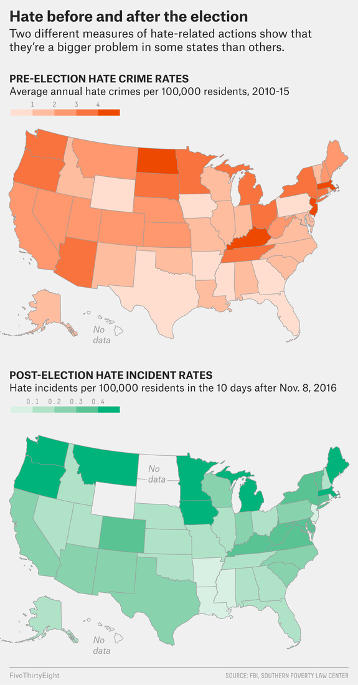

```{r global_options, include=FALSE}
## These are global specifications for how the RMarkdown file should knit. 
## Do not change these or delete these!
knitr::opts_chunk$set(eval = TRUE,
                      warning = FALSE,
                      fig.align = "center", 
                      message = FALSE)

set.seed(1234) 
## This will make your results not change every time you knit! 
```

In the 10 days after the 2016 election, nearly 900 hate incidents were reported to the Southern Poverty Law Center, averaging out to 90 per day. By comparison, about 36,000 hate crimes were reported to the FBI from 2010 through 2015 — an average of 16 per day.

The numbers we have are tricky; the data is limited by how it’s collected and can’t definitively tell us whether there were more hate incidents in the days after the election than is typical. What we can do, however, is look for trends within the numbers, such as how hate crimes vary by state, as well as what factors within those states might be tied to hate crime rates.

In this lab, you'll be analyzing data from Human Freedom Index reports from 2008-2016.
Your aim will be to summarize a few of the relationships within the data both graphically and numerically in order to find which variables can help tell a story about freedom.

# Getting Started

## Load Packages

In this lab, you will explore and visualize the data using the **tidyverse** suite of packages. 
You will also use the **moderndive** package to get nice looking regression tables, 
and the **infer** packate to carry out simulation based methods for hypothesis 
tests and confidence intervals. 

The data can be found in the **fivethirtyeight** package, which you will need to 
install before you are able to access the data. 

Let's load the packages!

```{r load-packages, message=FALSE}
library(tidyverse)
library(moderndive)
library(infer)
library(fivethirtyeight)
## This requires that you have installed the fivethirtyeight package!
```

# The Data

We will work with the `hate_crimes` dataset from the **fivethirtyeight** package, 
which contains data from the FBI and Southern Poverty Law Center on hate crimes 
both before and after the 2016 election. 

The federal government doesn’t track hate crimes systematically (agencies report
to the FBI voluntarily), and the Southern Poverty Law Center uses media accounts
and people’s self-reports to assess the situation. Moreover, FBI hate crimes
data for 2016 won’t be released for another several months, and the Southern
Poverty Law Center didn’t collect data before the 2016 election. However, both
data sources are publicly available and easy to navigate, which means they’re
some of the best we have.

But they also have biases baked in.

The FBI Uniform Crime Reporting Program collects hate crime data from law 
enforcement agencies. But because the data are submitted voluntarily, it’s
unclear how comprehensive the data set is. We don’t have data from Hawaii, for
instance. Moreover, the UCR Program collects data on only prosecutable hate
crimes, which make up a fraction of hate incidents (which includes
non-prosecutable offenses, such as circulation of white nationalist recruitment
materials on college campuses).

On the other hand, the Southern Poverty Law Center data — which come from a
combination of curated media accounts and self-reported form entries — includes
both hate crimes and non-prosecutable hate incidents. Moreover, heightened news
coverage of hate incidents after the election may have encouraged people to
report incidents that they would not have otherwise reported. This is called
awareness bias — a trend that is well-established in epidemiology, environmental
health and other fields of research that frequently use self-reported data.

Despite these limitations, both data sets reveal that hate incidents aren’t
uniformly distributed across the United States. In other words, a greater number
of hate incidents were reported in some states (per 100,000 people) than in
others — both according to the SPLC after the election and the FBI before it.


## Inspecting the Data 

__1.  What are the dimensions of the dataset?__
<!-- Your response goes here! Do not remove this line! -->

There are data from all 51 states, and 13 different variables. 

```{r}
## Code for question 1 below this line! 

dim(hate_crimes)

```

__2. Are there any states with missing data on hate crimes? If so, which states?__ 
<!-- Your response goes here! Do not remove this line! -->

Yes, there is no data on hate crimes for Hawaii, and North & South Dakota and 
Wyoming have missing data for directly after the election (November 9-18). 

```{r}
## Code for question 2 below this line! 

hate_crimes %>% 
  filter(is.na(avg_hatecrimes_per_100k_fbi) | is.na(hate_crimes_per_100k_splc))

```

# Visualizing the Relationship Between Hate Crimes and Income Inequality 

Income inequality is a known determinant for neighborhood violence and violence
in general, of which hate incidents may be considered a special subset. In an
economy that increasingly demands a college degree, high-school-educated
individuals aren’t able to earn as much as their college-educated neighbors.
This — combined with misplaced blame on targeted minority groups — may provide 
sufficient motivation for hate incidents against them.

3. Using the **ggplot** tools we've covered, create a visualization of the 
relationship between the number of hate crimes per 100,000 population from 
November 9-18, 2016 (`hate_crimes_per_100k_splc`) and income inequality 
(`gini_index`), where income inequality is the explanatory variable.  

```{r}
## Code for question 3 below this line! 
hate_crimes %>% 
  ggplot(aes(x = gini_index, y = hate_crimes_per_100k_splc)) + 
  geom_point()
```

__4. Next, create a visualization of the relationship between the average 
annual hate crimes per 100,000 population (`avg_hatecrimes_per_100k_fbi`) and
income inequality (`gini_index`), where income inequality is the explanatory
variable.   Does this trend look different from the 
trend seen in the hate crimes following the 2016 election?__ 


The trend looks slightly different, as there are fewer observations along the 
x-axis (at low values of hatecrimes), but both plots see the same outlier in the 
upper right corner with large income inequality and high hate crime rates. 

```{r}
## Code for question 4 below this line! 
hate_crimes %>% 
  ggplot(aes(x = gini_index, y = avg_hatecrimes_per_100k_fbi)) + 
  geom_point()
```

# Modeling the Relationship Between Hate Crimes and Income Inequality 

The Gini index is a measure of the deviation of the distribution of income
among individuals or households within a country from a perfectly equal
distribution. A value of 0 represents absolute equality, a value of 100 absolute
inequality <http://hdr.undp.org/en/content/income-gini-coefficient>.

In our analysis we will fit two regressions:  

1. modeling the average hate crimes per 100,000 population with the Gini index 
2. modeling the hate crimes per 100,000 population for November 9-18 with the
Gini index 

We will compare the results we obtain these models, to assess if the relationship 
between hate crimes and income inequality are similar. 

## Model 1: Average Hate Crimes & Income Inequality 

First, we will carry out a hypothesis test to investigate whether there is a 
linear relationship between average hate crimes and income inequality. Then, we 
will find a 99% confidence interval for this 

__5. Write out the null and alternative hypotheses we are testing, using *both* words and notation.__   
Hint: To notate you are referencing the population parameter, write out the letter of it's Greek name (beta). 
<!-- Your response goes here! Do not remove this line! -->


__6. What type of distribution will we be creating for our hypothesis test? A randomization distribution or a permutation distribution? Why?__ <!-- Your response goes here! Do not remove this line! -->


__7. Using your brain and the plots below, assess if the conditions necessary for inference are violated.__   
Hint: Keep in mind the sample size of these data! 

<!-- Your response goes here! Do not remove this line! -->


```{r}
avg_hate_lm <- lm(avg_hatecrimes_per_100k_fbi ~ gini_index, 
                  data = hate_crimes)

avg_hate_lm %>%
  ggplot(aes(x = .fitted, y = .resid)) + 
  geom_point() + 
  geom_hline(yintercept = 0, linetype = "dashed", color = "red") +
  xlab("Fitted values") +
  ylab("Residuals")

avg_hate_lm %>% 
ggplot(aes(x = .resid)) +
  geom_histogram(binwidth = 0.5) +
  xlab("Residuals")

```

__8. Generate 1000 permutations for testing if there is a linear relationship between average hate crimes and income inequality.__  
Hint: Remember to use the tools from the **infer** package to create your distribution of permuted slopes! 

```{r}
## Remember the three steps needed for conducting a hypothesis test: 
## 1. Calculate observed statistic 
## 2. Generate null distribution 
## 3. Calculate the p-value for the observed statistic

## Code for null distribution for question 8 goes below this line! 

null <- hate_crimes %>% 
  specify(avg_hatecrimes_per_100k_fbi ~ gini_index) %>% 
  hypothesise(null = "independence") %>% 
  generate(reps = 1000, type = "permute") %>% 
  calculate(stat = "slope")

null %>% 
visualise() + 
  ggtitle("Null Distribution for Relationship between \n Hate Crimes and Income Inequality")
```

__9. What is the p-value for your hypothesis test? What would you conclude for this test?__   
Hint: Deciding to reject or not **is not** a conclusion, you need to specify 
which hypothesis seems more plausible **and** what that means in the context of 
these data!  
<!-- Your response goes here! Do not remove this line! -->

If we chose an $\alpha$ of 0.05, we would reject the null, and conclude that 
there is a linear relationship between average hate crimes and income inequality. 

If we chose an $\alpha$ of 0.01, we would fail to reject the null, and conclude 
that there is not a linear relationship between average hate crimes and income 
inequality. 

See! The size of $\alpha$ you choose determines what conclusion you will reach! 


```{r}
## Code for p-value calculation for question 9 goes below this line! 
## Remember what you need for a p-value: an observed statistic, a null distribution, and a direction.  

avg_obs_slope <- hate_crimes %>% 
  specify(avg_hatecrimes_per_100k_fbi ~ gini_index) %>% 
  calculate(stat = "slope")

get_p_value(null, obs_stat = avg_obs_slope, direction = "two-sided")

```


__10. Generate 1000 bootstrap resamples to assess the variability we'd expect in the relationship between average hate crimes and income inequality.__ 

```{r}
## Remember the steps needed for finding a confidence interval: 
## 1. Generate a bootstrap distribution 
## 2. Keep __% of the boostrap resamples in the confidence interval

## Code for bootstrap distribution for question 10 goes below this line! 


bootstrap <- hate_crimes %>% 
  specify(avg_hatecrimes_per_100k_fbi ~ gini_index) %>% 
  generate(reps = 10000, type = "bootstrap") %>% 
  calculate(stat = "slope")

bootstrap %>% 
visualise() + 
  ggtitle("Bootstrap Distribution for Relationship between \n Hate Crimes and Income Inequality")

```


__11. Calculate a 95% confidence interval for the slope.__

```{r}
## Remember the steps needed for finding a confidence interval: 
## 1. Generate a bootstrap distribution 
## 2. Keep __% of the boostrap resamples in the confidence interval

## Code for calculating confidence interval for question 11 goes below this line!

get_confidence_interval(bootstrap, level = 0.95)

```

__12. Does your confidence interval agree with the decision you made in your hypothesis test?__
__Why do you believe this may be the case?__ 
<!-- Your response goes here! Do not remove this line! -->


## Model 2: November 9-18 Hate Crimes & Income Inequality 

Let's assess if we see similar patterns in the hate crimes committed between 
November 9 and 18, 2016. 

__13. Based on the null distribution and observed statistic below, do you believe you would come to a similar conclusion for the relationship between the November 2016 hate crimes and income inequality?__  
<!-- Your response goes here! Do not remove this line! -->


```{r}
obs_slope <- hate_crimes %>% 
  specify(hate_crimes_per_100k_splc ~ gini_index) %>% 
  calculate(stat = "slope")

null2 <- hate_crimes %>% 
  specify(hate_crimes_per_100k_splc ~ gini_index) %>% 
  hypothesise(null = "independence") %>% 
  generate(reps = 1000, type = "permute") %>% 
  calculate(stat = "slope")

null2 %>% 
visualise() +  
  shade_p_value(obs_stat = obs_slope, direction = "two-sided") +
  ggtitle("Null Distribution for Relationship between \n Hate Crimes and Income Inequality")
```

__14. Does the confidence interval below have the same issue as the confidence interval 

```{r}
bootstrap2 <- hate_crimes %>% 
  specify(hate_crimes_per_100k_splc ~ gini_index) %>% 
  generate(reps = 1000, type = "bootstrap") %>% 
  calculate(stat = "slope")

get_confidence_interval(bootstrap2, level = 0.95)

```


