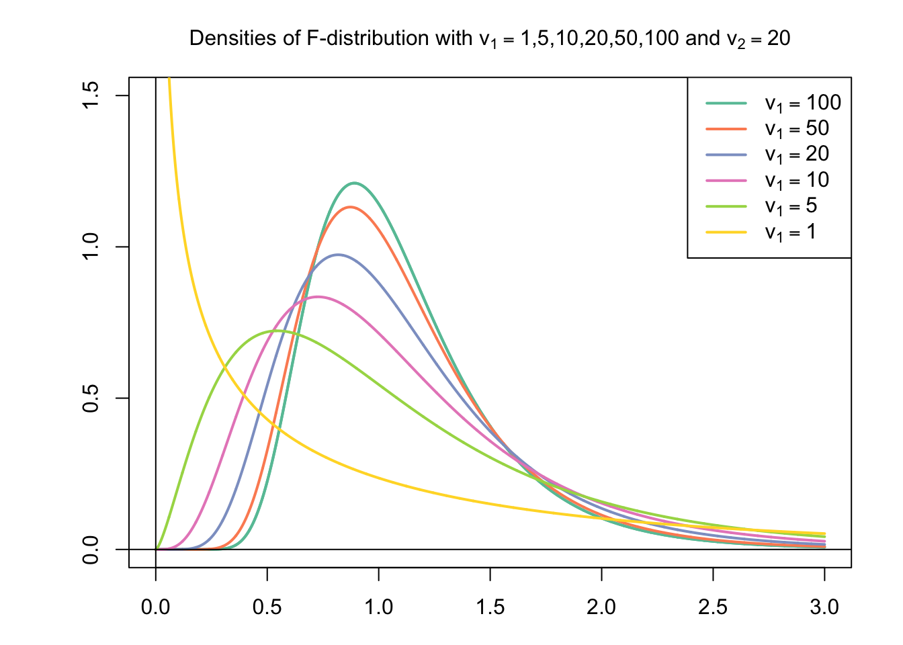
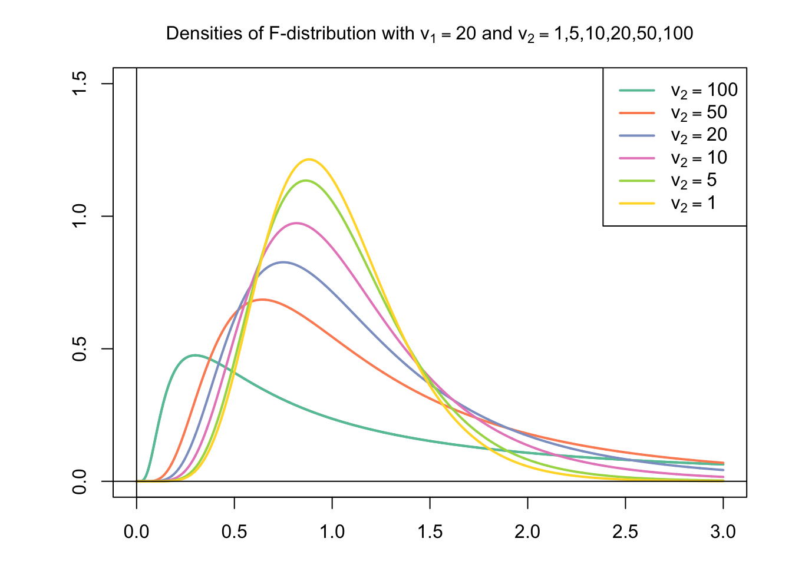

```{r, echo = FALSE, message = FALSE, warning = FALSE}
# R options
options(
  htmltools.dir.version = FALSE,
  tibble.width = 65,
  width = 65
  )

# figure height, width, dpi
knitr::opts_chunk$set(fig.width = 8, 
                      fig.asp = 0.618,
                      out.width = "60%",
                      dpi = 300, 
                      warning = FALSE, 
                      message = FALSE, 
                      fig.align = "center",
                      echo = FALSE)

# fontawesome
htmltools::tagList(rmarkdown::html_dependency_font_awesome())

# magick
dev.off <- function(){
  invisible(grDevices::dev.off())
}

# xaringanExtra
library(xaringanExtra)
xaringanExtra::use_panelset()

library(emo)
library(tidyverse)
library(moderndive)
library(openintro)
library(ggridges)
library(flair)
library(broom)
library(gridExtra)
library(kableExtra)
library(infer)

options(show.signif.stars = FALSE)
```

```{r set-theme, include = FALSE, cache = TRUE}
library(xaringanthemer)
style_duo_accent(
  primary_color      = "#b76352", # mango
  secondary_color    = "#34605f", # bayberry
  header_font_google = google_font("Raleway"),
  text_font_google   = google_font("Raleway", "300", "300i"),
  code_font_google   = google_font("Source Code Pro"),
  header_color = "#793540", #rhubarb
  white_color = "#F5F5F5", # lightest color
  black_color = "#36454F", # darkest color
  text_font_size = "30px", 
  link_color = "#696969" #grey
)


hfi_new <- hfi %>% 
  select(hf_score, pf_score, year) %>% 
  drop_na() %>% 
  mutate(year_f = as.factor(year)) %>% 
  filter(year %in% 2008:2013)

```


class: middle, inverse, center


.larger[.hand[What if year was categorical?]]

---

class: center

```{r, eval = FALSE}
pf_lm <- lm(hf_score ~ pf_score * year_f, data = hfi_new)

get_regression_table(pf_lm)

```


```{r, echo = FALSE}
pf_lm <- lm(hf_score ~ pf_score * year_f, data = hfi_new)

get_regression_table(pf_lm) %>% 
  kable() %>% 
  kable_styling()

```

---

class: center, middle, inverse

.larger[.hand[How would you test if the slopes were different?]]


---

class: center, middle

.huge[ANOVA!]

--

.larger[Big idea: Test if **at least one** mean differs in a group of 3 or more] 


---

class: center, middle


```{r anova, echo = FALSE, eval = FALSE}
anova(pf_lm)
```

```{r, echo = FALSE}
decorate_chunk("anova", eval = TRUE, echo = TRUE) %>% 
  flair(pattern = "anova")
```


---

class: center, middle

.larger[Breaking down variability in **y**]

```{r, out.width = "60%", out.height = "50%"}
hfi_new %>% 
  ggplot(mapping = aes(x = pf_score, y = hf_score)) + 
  geom_point() + 
  facet_wrap(~year_f, nrow = 2) +
  labs(x = "Personal Freedom", 
       y = "Human Freedom") + 
  theme(axis.title = element_text(size = 14))
```


---

class: center, middle, inverse

.larger[A new distribution]


```{r, out.width = "75%"}
null_dist <- hfi_new %>% 
  specify(hf_score ~ year_f) %>% 
  assume(distribution = "F") 

visualise(null_dist) + 
  labs(title = "", 
       x = "F Statistic") +
  theme(axis.title.x = element_text(size = 14))
```

---

class: middle, inverse

.larger[Two degrees of freedom!]

.pull-left[

]

.pull-right[

]


---

class: center, middle

.huge[ANOVA is everywhere!]

--

.larger["Overall F-test" for Regression]

```{r}
f_stat <- tibble(stat = summary(pf_lm)$fstatistic["value"], 
                 df_num = summary(pf_lm)$fstatistic["numdf"], 
                 df_denom = summary(pf_lm)$fstatistic["dendf"])

f_stat <- f_stat %>% 
  mutate(p_value = 1 - pf(stat, df_num, df_denom))


kable(f_stat, 
      col.names = c("F-Statistic", "Numerator Degrees of Freedom", 
                    "Denominator Degrees of Freedom", "p-value")) %>% 
  kable_styling()
```


