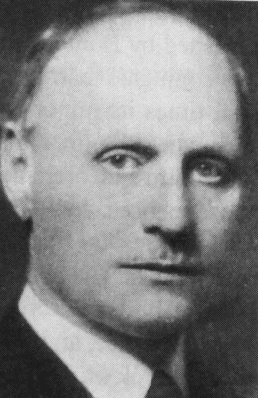

<style type="text/css">
slides > slide:not(.nobackground):after {
  content: '';
}
</style>

```{r setup, include=FALSE}
knitr::opts_chunk$set(warning = FALSE, 
                      message = FALSE)
library(tidyverse) 
library(openintro)
library(broom)

classdata <- classdata %>% 
  mutate(exam = lecture)
```

## Rejecting the Null 

In an ANVOA, when you reject $H_0$, you can only state that there is evidence 
that _at least one_ mean differs from the others. 

- This may be slightly unsatisfying. 
- You may be interested in _which_ means differ from each other.  

To do this, it is common to perform comparisons of the means of every group. 

## Multiple Comparisons 

The idea of multiple comparisons is that you perform a difference in means 
comparison (i.e. $\mu_1 = \mu_2$) for every possible combination of group means. 

- We can remember from algebra, that if we choose any 2 means out of $k$ group 
means, we can use ${k \choose 2} = \frac{k \cdot (k - 1)}{2}$. 
- The number of comparisons gets big fast as $k$ gets larger!

</br> 

For example, with 4 groups we'd have 6 comparisons. 

- With 6 groups we would have 15 comparisons. 
- With 8 groups we'd have 28 comparisons. 
- With 10 groups we'd have 45 comparisons. 

## Number of Tests & Type I Error 

When conducting __lots__ of hypothesis tests, we need to start worrying about 
our Type I error rates. 

- We expect to make a Type I error about 5% of the time with an $\alpha$ of 0.05. 

```{r, fig.align='center', fig.width=4, fig.height=3.5, echo = FALSE}
n <- seq(1, 100, by = 1)
alpha <- 0.05
prob_error <- (1 - (1 - alpha)^n) 
errors <- data.frame(n = n, error_prob = prob_error)

errors %>% 
  ggplot(aes(x = n, y = error_prob)) + 
  geom_line() + 
  labs(x = "Number of Comparisons", 
       y = "Probability of Type I Error")

```

## Fixing Error Rate Problem 

We can fix the error rate problem by specifying a "family" $\alpha$ value, for 
all of the comparisons.  

- The family $\alpha$ is then spread to each test evenly. 
- This is called the Bonferroni correction. 

```{r, fig.width=4, fig.height=4, echo = FALSE, fig.align='center', fig.cap="Carlo Emilio Bonferroni (1882-1960)"}

```

## Family Error Rate 

The new $\alpha$ is $\alpha^\star = \frac{\alpha}{k}$, where $k$ is the
number of hypotheses. 

</br> 

For testing 6 groups at the 0.05 significance level,  
$$\alpha^\star = \frac{0.05}{15} = 0.00333$$

## Performing Multiple Comparisons 

To run a multiple comparison of every group mean, we can use the 
`pairwise.t.test()` function. 

- To use the Bonferroni correction, set `p.adjust.method` to `"bonferroni"`. 

```{r, eval = TRUE}
classdata %$%  
  pairwise.t.test(x = m1, g = exam, p.adjust.method = "bonferroni") %>% 
  tidy()

```


