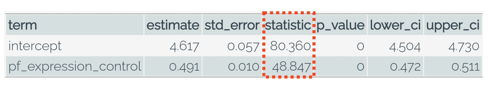
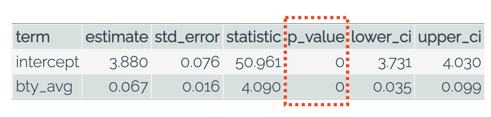
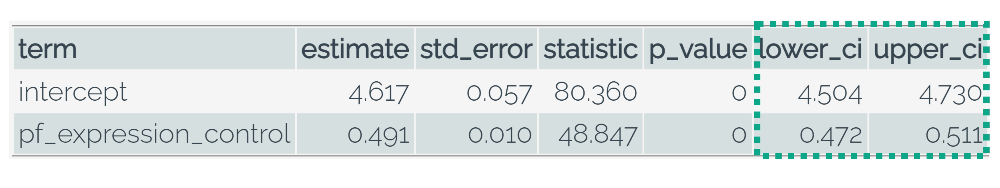

```{r, echo = FALSE, message = FALSE, warning = FALSE}
# R options
options(
  htmltools.dir.version = FALSE,
  tibble.width = 65,
  width = 65
  )

# figure height, width, dpi
knitr::opts_chunk$set(fig.width = 8, 
                      fig.asp = 0.618,
                      out.width = "60%",
                      dpi = 300, 
                      warning = FALSE, 
                      message = FALSE, 
                      fig.align = "center",
                      echo = FALSE)

# fontawesome
htmltools::tagList(rmarkdown::html_dependency_font_awesome())

# magick
dev.off <- function(){
  invisible(grDevices::dev.off())
}

# xaringanExtra
library(xaringanExtra)
xaringanExtra::use_panelset()

library(emo)
library(tidyverse)
library(moderndive)
library(openintro)
library(ggridges)
library(flair)
library(broom)
library(gridExtra)
library(kableExtra)
library(infer)

options(show.signif.stars = FALSE)
```

```{r set-theme, include = FALSE, cache = TRUE}
library(xaringanthemer)
style_duo_accent(
  primary_color      = "#b76352", # mango
  secondary_color    = "#34605f", # bayberry
  header_font_google = google_font("Raleway"),
  text_font_google   = google_font("Raleway", "300", "300i"),
  code_font_google   = google_font("Source Code Pro"),
  header_color = "#793540", #rhubarb
  white_color = "#F5F5F5", # lightest color
  black_color = "#36454F", # darkest color
  text_font_size = "30px", 
  link_color = "#696969" #grey
)


obs_slope <- hfi %>% 
  specify(response = pf_score, explanatory = pf_expression_control) %>% 
  calculate(stat = "slope") %>% 
  pull()

bootstrap_slope <- hfi %>% 
  specify(response = pf_score, explanatory = pf_expression_control) %>% 
  generate(reps = 1000, type = "bootstrap") %>% 
  calculate(stat = "slope")

null_slope <- hfi %>% 
  specify(response = pf_score, explanatory = pf_expression_control) %>%
  hypothesise(null = "independence") %>% 
  generate(reps = 1000, type = "permute") %>% 
  calculate(stat = "slope")
```

class: center, middle, inverse

.huge[Human Freedom]

--

.large[Serves as a rough measure for the relationships between the different
types of freedom including: freedom of movement, speech, assembly and religion,
as well as economic freedom, the ability of individuals to make their own
economic decisions without government or crony interference.]

<!-- In 2020, New Zealand toped the Human Freedom Index, followed by Switzerland, -->
<!-- Hong Kong, Denmark and Australia. -->
<!-- The five least-free countries are (in descending order) Iran, Yemen, Venezuela, -->
<!-- Sudan and Syria. -->
<!-- Rankings for other significant countries include Canada (6th), Germany (9th), -->
<!-- the United Kingdom and the United States (tied for 17th). -->

---

class: center, middle

.larger[Visualizing the Linear Relationship]

```{r}
hfi %>% 
  ggplot(mapping = aes(x = pf_expression_control, y = pf_score)) +
  geom_jitter() + 
  geom_smooth(method = "lm") +
  labs(x = "Personal Freedom of Expression", 
       y = "Personal Freedom Score") + 
  theme(axis.title = element_text(size = 20), 
        axis.text = element_text(size = 16))

```

---

class: center, middle

.larger[Estimating the Linear Relationship]

```{r, echo = TRUE, eval = FALSE}
pf_lm <- lm(pf_score ~ pf_expression_control, data = hfi)

get_regression_table(pf_lm)
```

```{r, echo = FALSE}
pf_lm <- lm(pf_score ~ pf_expression_control, data = hfi)

get_regression_table(pf_lm) %>% 
  kable() %>% 
  kable_styling()
```


---

class: middle, center

.larger[But first!]

.larger[We need to check the conditions.]

--

**L**inear relationship

--

**I**dependence of observations

--

**N**ormality of residuals

--

**E**qual variance of residuals

---

class: center, middle

.larger[**N**ormality of Residuals]

```{r, echo = TRUE, eval = FALSE}
get_regression_points(pf_lm) %>% 
  ggplot(mapping = aes(x = residual)) + 
  geom_histogram(binwidth = 0.6) 
```

```{r}
get_regression_points(pf_lm) %>% 
  ggplot(mapping = aes(x = residual)) + 
  geom_histogram(binwidth = 0.6) + 
  theme(axis.title = element_text(size = 20), 
        axis.text = element_text(size = 16))
```

---

class: center, middle

.larger[**E**qual Variance of Residuals]

```{r, echo = TRUE, eval = FALSE}
get_regression_points(pf_lm) %>% 
  ggplot(mapping = aes(y = residual, x = pf_score_hat)) + 
  geom_jitter()
```

```{r, echo = FALSE}
get_regression_points(pf_lm) %>% 
  ggplot(mapping = aes(y = residual, x = pf_score_hat)) + 
  geom_jitter() +
  geom_hline(yintercept = 0, color = "red", size = 1.5) + 
  theme(axis.title = element_text(size = 20), 
        axis.text = element_text(size = 16))
```

---

class: middle, center

.larger[**Testing for a Linear Relationship**]

</br> 

> .large[What would our null and alternative hypotheses be?]

> .large[The null hypothesis for testing a slope is $\beta = 0.$ What does this
hypothesis *mean* (i.e. what are you testing)?]

---

class: center

.larger[**Permutation Distribution for the Slope**]


```{r, eval = FALSE, echo = TRUE}
hfi %>% 
  specify(response = pf_score, explanatory = pf_expression_control) %>% 
  hypothesize(null = "independence") %>% 
  generate(reps = 1000, type = "permute") %>% 
  calculate(stat = "slope")
```


---

class: center

.larger[Visualizing the Distribution]

```{r}
null_slope %>% 
  visualize() +
  labs(x = "Permuted Slope Statistic", 
       title = "") 
```

---

class: center

.larger[Statistic of Interest]

.pull-left[
```{r, out.width = "95%"}
null_slope %>% 
  visualize() +
  labs(x = "Permuted Slope Statistic", 
       title = "") + 
  geom_vline(xintercept = obs_slope, 
             color = "red",
             lty = "dashed", 
             size = 1.5)
```
]

.pull-right[
</br>


]

--

> How is the "statistic" in the regression table found? How does this differ 
from the observed slope? 

---

class: center

.larger[p-value]

.pull-left[
```{r, out.width = "95%"}
null_slope %>% 
  visualize() +
  shade_p_value(obs_stat = obs_slope, direction = "both") +
  labs(x = "Permuted Slope Statistic", 
       title = "") 
```
]

.pull-right[
</br>


]

--

> How is the p-value in the regression table found? How does this differ from 
simulation-based methods?

---

class: center, middle, inverse

.larger[What range of values might the population parameter lie between?]

---

class: center

.larger[Bootstrapping!]

```{r, out.width = "75%"}

size <- nrow(hfi)

hfi %>% 
  rep_sample_n(size = size, replace = TRUE, reps = 10) %>% 
  ggplot() + 
  geom_smooth(aes(x = pf_expression_control, y = pf_score, group = replicate), 
              method = "lm", 
              se = FALSE, 
              fullrange = TRUE, 
              alpha = 0.1, 
              size = 0.2) +
  geom_smooth(data = hfi, aes(x = pf_expression_control, y = pf_score), 
              color = "red", 
              lty = "dashed", 
              method = "lm",
              se = FALSE, 
              size = 0.5) +
  labs(x = "Personal Freedom of Expression", 
       y = "Personal Freedom") + 
  theme(axis.title = element_text(size = 20), 
        axis.text = element_text(size = 16))
```

---

class: center

.larger[**Bootstrap Distribution for the Slope**]

```{r, eval = FALSE, echo = TRUE}
hfi %>% 
  specify(response = pf_score, explanatory = pf_expression_control) %>% 
  generate(reps = 1000, type = "bootstrap") %>% 
  calculate(stat = "slope")
```


---

class: center, middle

.larger[Visualizing the Distribution]

```{r}
bootstrap_slope %>% 
  visualize() +
  labs(x = "Bootstrap Slope Statistic", 
       title = "") 
```

---

class: center

.larger[**95% Confidence Interval**]

.pull-left[
```{r, out.width = "95%"}
ci <- bootstrap_slope %>% 
  get_confidence_interval(level = 0.95, type = "percentile")

bootstrap_slope %>% 
  visualize() +
  labs(x = "Bootstrap Slope Statistic", 
       title = "") + 
  shade_ci(ci)

ci %>% 
  kable() %>% 
  kable_styling()
```
]

.pull-right[

</br>


]

---

class: center, middle, inverse

.hand[.huge[Why so similar?]]
