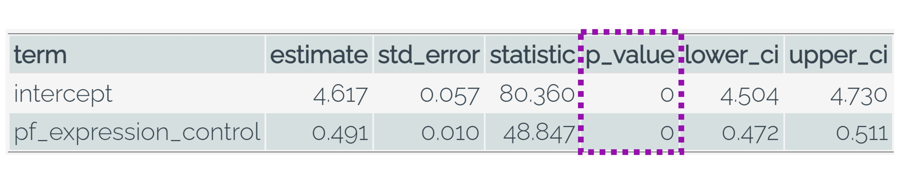

```{r, echo = FALSE, message = FALSE, warning = FALSE}
# R options
options(
  htmltools.dir.version = FALSE,
  tibble.width = 65,
  width = 65
  )

# figure height, width, dpi
knitr::opts_chunk$set(fig.width = 8, 
                      fig.asp = 0.618,
                      out.width = "60%",
                      dpi = 300, 
                      warning = FALSE, 
                      message = FALSE, 
                      fig.align = "center",
                      echo = FALSE)

# fontawesome
htmltools::tagList(rmarkdown::html_dependency_font_awesome())

# magick
dev.off <- function(){
  invisible(grDevices::dev.off())
}

# xaringanExtra
library(xaringanExtra)
xaringanExtra::use_panelset()

library(emo)
library(tidyverse)
library(moderndive)
library(openintro)
library(ggridges)
library(flair)
library(broom)
library(gridExtra)
library(kableExtra)
library(infer)

options(show.signif.stars = FALSE)
```

```{r set-theme, include = FALSE}
library(xaringanthemer)
style_duo_accent(
  primary_color      = "#b76352", # mango
  secondary_color    = "#34605f", # bayberry
  header_font_google = google_font("Raleway"),
  text_font_google   = google_font("Raleway", "300", "300i"),
  code_font_google   = google_font("Source Code Pro"),
  header_color = "#793540", #rhubarb
  white_color = "#F5F5F5", # lightest color
  black_color = "#36454F", # darkest color
  text_font_size = "30px", 
  link_color = "#696969" #grey
)


evals_small <- evals %>% 
  group_by(prof_id) %>% 
  sample_n(size = 1) %>% 
  ungroup()

obs_slope <- evals %>% 
  specify(score ~ bty_avg) %>% 
  calculate(stat = "slope") %>% 
  pull()

bootstrap_slope <- evals %>% 
  specify(formula = score ~ bty_avg) %>%
  generate(reps = 1000, type = "bootstrap") %>% 
  calculate(stat = "slope")

null_slope <- evals %>% 
  specify(formula = score ~ bty_avg) %>%
  hypothesise(null = "independence") %>% 
  generate(reps = 1000, type = "permute") %>% 
  calculate(stat = "slope")
```

class: center, middle

.huge[Confidence interval]

</br>

.larger[**What slopes might we have gotten from other samples?**]

---

.larger[Bootstrapping!]

```{r}
evals %>% 
  rep_sample_n(size = 463, replace = TRUE, reps = 25) %>% 
  ggplot() + 
  geom_smooth(aes(x = bty_avg, y = score, group = replicate), 
              method = "lm", 
              se = FALSE, 
              fullrange = TRUE, 
              alpha = 0.8) +
  geom_smooth(data = evals, aes(x = bty_avg, y = score), 
              color = "red", 
              lty = "dashed", 
              method = "lm",
              se = FALSE) +
  labs(x = "Average Beauty Score (0 to 10)", 
       y = "Course Evaluation Score (1 to 5)")
```

---

class: center

.larger[**Bootstrap Distribution for the Slope**]

```{r}
bootstrap_slope %>% 
  visualize() +
  labs(x = "Bootstrap Slope Statistic", 
       title = "") + 
  geom_vline(xintercept = obs_slope,
        color = "red",
        lty = "dashed", 
        lwd = 1.5)
```

---

class: center

.larger[**95% Confidence Interval**]


```{r, out.width = "95%"}
ci <- bootstrap_slope %>% 
  get_confidence_interval(level = 0.95, type = "percentile")

bootstrap_slope %>% 
  visualize() +
  labs(x = "Bootstrap Slope Statistic", 
       title = "") + 
  shade_ci(ci)

ci %>% 
  kable() %>% 
  kable_styling()
```


---

.pull-right[

]

---

class: middle, center

.huge[Hypothesis test]

</br> 

.larger[**What slope would we expect if there was no linear relationship?**]

---

.larger[Permuting!]

```{r}

evals %>% 
  selec
  rep_sample_n(size = 463, replace = TRUE, reps = 25) %>% 

    
    ggplot() + 
  geom_smooth(aes(x = bty_avg, y = score, group = replicate), 
              method = "lm", 
              se = FALSE, 
              fullrange = TRUE, 
              alpha = 0.8) +
  geom_smooth(data = evals, aes(x = bty_avg, y = score), 
              color = "red", 
              lty = "dashed", 
              method = "lm",
              se = FALSE) +
  labs(x = "Average Beauty Score (0 to 10)", 
       y = "Course Evaluation Score (1 to 5)")
```

---

class: center

.larger[**Permutation Distribution for the Slope**]

```{r}
null_slope %>% 
  visualize() +
  labs(x = "Permuted Slope Statistic", 
       title = "") + 
  geom_vline(xintercept = obs_slope,
        color = "red",
        lty = "dashed", 
        lwd = 1.5)
```


---

.larger[Statistic]

.pull-left[]

.pull-right[

]

---

.larger[p-value]

.pull-left[]

.pull-right[

]

---

class: center, inverse

.larger[Conditions for Inference]

--

For regression, there are four conditions for inference:  

- **L**inear relationship
- **I**ndependence of observations
- **N**ormality of residuals
- **E**qual variance of residuals

---

